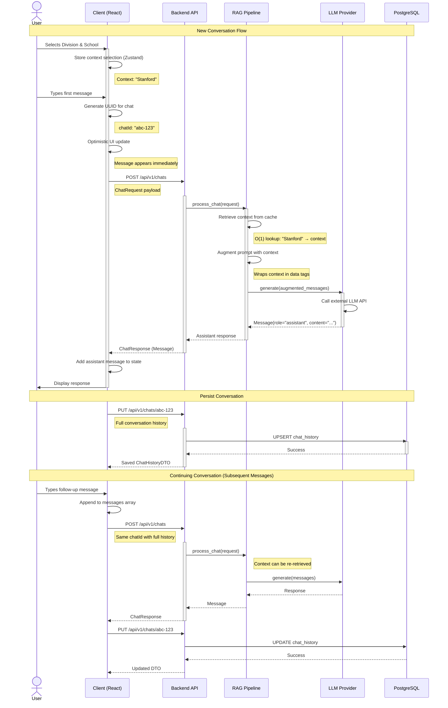

# Diagram 1: High-Level Chat Sequence Flow

## Complete User Journey: From UI Interaction to Persistent Storage



## Key Design Decisions Illustrated

### 1. **Client-Side ID Generation**
- **Why**: Enables optimistic updates, offline support, reduces coupling
- **Trade-off**: Must handle ID collisions (UUID v4 makes this negligible)

### 2. **Optimistic UI Updates**
- **Why**: Instant feedback, perceived performance
- **Trade-off**: Must handle rollback on error (currently TODO)

### 3. **Full Message History in Request**
- **Why**: Backend is stateless, client controls conversation context
- **Trade-off**: Larger payloads (mitigated: JSON compression, reasonable limits)

### 4. **Separate Save Operation**
- **Why**: Decouples generation from persistence, allows retry logic
- **Trade-off**: Two API calls (could be combined, but separation is cleaner)

### 5. **Context as Query Parameter**
- **Why**: Generic abstraction - "contextQuery" could be school, document ID, user ID, etc.
- **Pattern**: Dependency Inversion - client doesn't know what context means

## State Management Strategy

```
┌─────────────────────────────────────────────┐
│              Client State                    │
├─────────────────────────────────────────────┤
│                                              │
│  Zustand Store (In-Memory + LocalStorage)   │
│  ├─ currentChatId                            │
│  ├─ messages[] ◄────────┐                   │
│  ├─ selectedDivision     │                   │
│  └─ selectedSchool       │                   │
│                          │                   │
│  React Query (Server State Cache)           │
│  ├─ ['chat', chatId] ────┘ Hydrates on load │
│  ├─ ['chats', userId]    Cached queries     │
│  └─ ['divisions']        24hr TTL           │
│                                              │
└─────────────────────────────────────────────┘
                     │
                     │ Persists to
                     ↓
┌─────────────────────────────────────────────┐
│          Backend Persistence                 │
├─────────────────────────────────────────────┤
│                                              │
│  PostgreSQL: chat_history table              │
│  ├─ id (PK)                                  │
│  ├─ user_id (FK, indexed)                   │
│  ├─ messages (JSON[])  ◄─ Source of truth   │
│  ├─ created_date                             │
│  └─ updated_date                             │
│                                              │
└─────────────────────────────────────────────┘
```

**Why this architecture?**
- **Client state is disposable** - can be rebuilt from backend
- **Backend is source of truth** - enables multi-device sync
- **Cache invalidation strategy** - React Query handles staleness
- **LocalStorage for UX only** - Remembers user preferences, not data
