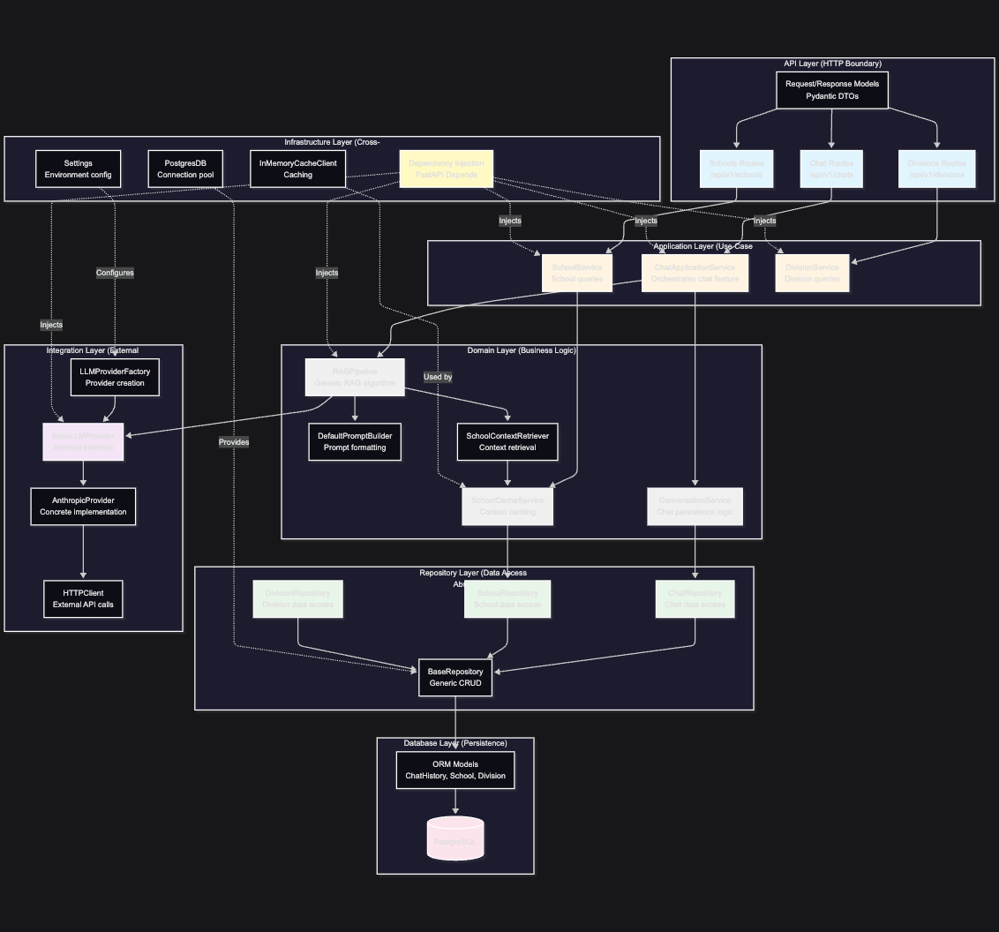

# 2: Backend Layered Architecture

## Vertical Separation of Concerns with Domain-Driven Design



## Dependency Flow Rules

### Allowed Dependencies (Top → Down)
- **API Layer** → Application Layer
- **Application Layer** → Domain Layer + Integration Layer
- **Domain Layer** → Repository Layer
- **Repository Layer** → Database Layer
- **All Layers** → Infrastructure Layer (via DI)

### Forbidden Dependencies (Bottom → Up, Horizontal)
- Database Layer **CANNOT** depend on Repository Layer
- Integration Layer **CANNOT** depend on Domain Logic
- Layers **SHOULD NOT** depend on adjacent layers at same level

### Why This Matters
- **Testability**: Can mock entire layers
- **Replaceability**: Swap implementations without touching other layers
- **Understanding**: Clear boundaries make onboarding easier

---

## Layer Responsibilities Detailed

### 1. **API Layer** (HTTP Boundary)
**Purpose**: Transform HTTP ↔ Domain concepts

**Responsibilities**:
- Route definitions (`@app.post("/chats")`)
- Request validation (Pydantic models)
- Response serialization
- HTTP-specific concerns (status codes, headers)

**Does NOT**:
- Contain business logic
- Make database calls directly
- Know about LLM providers

**Files**:
- `app/chat/routes.py` - `/api/v1/chats` endpoints
- `app/ncaa/schools/routes.py` - `/api/v1/schools` endpoints
- `app/ncaa/divisions/routes.py` - `/api/v1/divisions` endpoints
- `app/chat/models/dto.py` - ChatRequest, ChatHistoryDTO
- `app/ncaa/schools/models.py` - SchoolDTO, SchoolResponse
- `app/ncaa/divisions/models.py` - DivisionDTO, DivisionResponse

**Example**:
```python
@chat_router.post("", response_model=Message)
async def post_chat(
    chat_request: ChatRequest,
    chat_service: ChatApplicationService = Depends(get_chat_application_service),
) -> Message:
    """Just validates and delegates - no business logic"""
    response_message = await chat_service.generate_response(chat_request)
    return response_message
```

---

### 2. **Application Layer** (Use Case Orchestration)
**Purpose**: Coordinate multi-step use cases

**Responsibilities**:
- High-level flow control
- Calling multiple domain services in sequence
- Cross-domain coordination (e.g., chat + RAG)
- Transaction boundaries

**Pattern**: **Application Service Pattern** - Orchestrates use cases

**Does NOT**:
- Implement business rules (delegates to domain layer)
- Directly access database (uses repositories)
- Know about HTTP/API details

**Files**:
- `app/chat/services/chat_application.py` - ChatApplicationService
- `app/ncaa/schools/service/school_service.py` - SchoolService
- `app/ncaa/divisions/service.py` - DivisionService

**Example**:
```python
class ChatApplicationService:
    def __init__(self, rag_pipeline: RAGPipeline, conversation_store: ConversationService):
        self.rag_pipeline = rag_pipeline
        self.conversation_store = conversation_store

    async def generate_response(self, chat_request: ChatRequest) -> Message:
        # Orchestrates: RAG generation
        response = await self.rag_pipeline.generate(
            messages=chat_request.messages,
            context_key=chat_request.context_key,
        )
        return response

    async def save_conversation(self, session: AsyncSession, chat_request: ChatRequest):
        # Orchestrates: Conversation persistence
        chat_history_dto = self._to_chat_history_dto(chat_request)
        await self.conversation_store.save_conversation(session, chat_history_dto)
```

---

### 3. **Domain Layer** (Business Logic)
**Purpose**: Enforce business rules, domain knowledge

**Responsibilities**:
- Domain-specific validation
- Business rule enforcement
- Data transformation (DTOs)
- Complex business logic
- Pure functions where possible

**Patterns**:
- **Domain Service**: ConversationService, SchoolCacheService
- **Template Method**: RAGPipeline
- **Builder**: PromptBuilder
- **Strategy**: Different retrievers

**Does NOT**:
- Know about HTTP
- Make direct database calls (uses repositories)
- Know about specific LLM providers (uses abstractions)

**Files**:
- `app/chat/services/conversation_store.py` - ConversationService
- `app/ncaa/schools/service/cache_service.py` - SchoolCacheService
- `app/rag/pipeline.py` - RAGPipeline
- `app/rag/prompt_builders/default.py` - DefaultPromptBuilder
- `app/rag/retrievers/school_retriever.py` - SchoolContextRetriever

**Example**:
```python
class ConversationService:
    """Domain service for conversation persistence logic"""

    def __init__(self, chat_repo: ChatRepository):
        self.chat_repo = chat_repo

    async def save_conversation(
        self, session: AsyncSession, chat_history_dto: ChatHistoryDTO
    ) -> ChatHistoryDTO:
        # Business logic: Validate, transform, save
        saved_chat = await self.chat_repo.update(session, chat_history_dto)
        logger.info(f"Conversation saved: {saved_chat.id} for user {saved_chat.user_id}")
        return saved_chat
```

**Example (RAGPipeline)**:
```python
class RAGPipeline:
    """Generic RAG algorithm - Template Method Pattern"""

    async def generate(self, messages: List[Message], context_key: Optional[str]) -> Message:
        # Step 1: Retrieve context (pluggable)
        context = await self.retriever.retrieve(context_key) if context_key else None

        # Step 2: Augment messages (pluggable)
        if context and messages:
            augmented = self.prompt_builder.format_user_message(
                query=messages[-1].content,
                context=context
            )
            messages[-1] = Message(role="user", content=augmented)

        # Step 3: Ensure system prompt
        if not any(msg.role == "system" for msg in messages):
            system_prompt = self.prompt_builder.get_system_prompt()
            messages = [Message(role="system", content=system_prompt)] + messages

        # Step 4: Generate (pluggable)
        return await self.llm_provider.generate(messages)
```

---

### 4. **Repository Layer** (Data Access Abstraction)
**Purpose**: Abstract database operations

**Responsibilities**:
- CRUD operations
- Query building
- ORM interaction
- DTO ↔ ORM model translation

**Patterns**:
- **Repository Pattern**: Hide persistence details
- **Template Method**: BaseRepository with generic operations
- **DTO Pattern**: Isolate domain from ORM

**Does NOT**:
- Contain business logic
- Know about HTTP/API
- Know about LLM providers

**Files**:
- `app/common/repository.py` - BaseRepository[TModel, TDTO]
- `app/chat/repository.py` - ChatRepository
- `app/ncaa/schools/repository.py` - SchoolRepository
- `app/ncaa/divisions/repository.py` - DivisionRepository

**Example**:
```python
class BaseRepository[TModel, TDTO]:
    """Generic repository with automatic DTO conversion"""

    async def get_by_id(
        self, session: AsyncSession, id_value: str, id_column: str = "id", **filters
    ) -> Optional[TDTO]:
        query = select(self.model).where(getattr(self.model, id_column) == id_value)
        query = self._apply_filters(query, **filters)
        result = await session.execute(query)
        model_instance = result.scalars().first()
        return self._orm_to_dto(model_instance) if model_instance else None

class ChatRepository(BaseRepository[ChatHistory, ChatHistoryDTO]):
    """Domain-specific repository extending base"""

    async def get_user_chats(
        self, session: AsyncSession, user_id: str, limit: int = 10, offset: int = 0
    ) -> List[ChatHistoryDTO]:
        query = (
            select(ChatHistory)
            .where(ChatHistory.user_id == user_id)
            .order_by(ChatHistory.created_date.desc())
            .offset(offset)
            .limit(limit)
        )
        result = await session.execute(query)
        chats = result.scalars().all()
        return [self._orm_to_dto(chat) for chat in chats]
```

---

### 5. **Database Layer** (Persistence)
**Purpose**: Data persistence, ORM models

**Responsibilities**:
- Table definitions (SQLAlchemy models)
- Relationships, indexes, constraints
- Migrations (Alembic)

**Does NOT**:
- Contain queries (repositories do this)
- Contain business logic

**Files**:
- `app/chat/models/db_models.py` - ChatHistory, Feedback ORM
- `app/ncaa/db_models.py` - Division, School ORM
- `alembic/versions/` - Database migrations

**Example**:
```python
class ChatHistory(Base):
    """ORM model for chat history"""
    __tablename__ = "chat_history"
    __table_args__ = {"schema": SCHEMA}

    id = Column(String, primary_key=True)
    user_id = Column(String, nullable=False, index=True)
    messages = Column(JSON, nullable=False)
    created_date = Column(TIMESTAMP(timezone=True), nullable=False)
    updated_date = Column(TIMESTAMP(timezone=True))
```

---

### 6. **Integration Layer** (External Systems)
**Purpose**: Abstract external dependencies

**Responsibilities**:
- External API communication
- Protocol translation (Message ↔ provider format)
- Error handling for external calls

**Patterns**:
- **Factory Pattern**: LLMProviderFactory
- **Strategy Pattern**: BaseLLMProvider
- **Adapter Pattern**: Translate to/from provider formats

**Does NOT**:
- Contain business logic
- Know about database
- Know about HTTP/API details

**Files**:
- `app/integrations/llm/base.py` - BaseLLMProvider ABC
- `app/integrations/llm/anthropic.py` - AnthropicProvider
- `app/integrations/llm/factory.py` - LLMProviderFactory
- `app/integrations/llm/models.py` - LLMConfig

**Example**:
```python
class BaseLLMProvider(ABC):
    """Strategy interface for LLM providers"""

    @abstractmethod
    async def generate(self, messages: List[Message], **kwargs) -> Message:
        """Generic interface - implementation details hidden"""
        pass

class AnthropicProvider(BaseLLMProvider):
    """Adapter for Anthropic Claude API"""

    async def generate(self, messages: List[Message], **kwargs) -> Message:
        # Translate: Message → Anthropic format
        system_messages, non_system = self._separate_system_messages(messages)
        anthropic_messages = self._to_anthropic_format(non_system)

        # Call external API
        response = await self.http_client.post(
            url=self.base_url,
            json={
                "model": self.model,
                "messages": anthropic_messages,
                "system": system_messages,
                **kwargs
            }
        )

        # Translate: Anthropic format → Message
        return self._parse_response(response)
```

---

### 7. **Infrastructure Layer** (Cross-Cutting)
**Purpose**: Shared utilities, configuration, DI

**Responsibilities**:
- Dependency injection setup
- Configuration management
- Logging, monitoring
- Shared utilities (HTTP client, caching)

**Patterns**:
- **Dependency Injection**: Loose coupling
- **Singleton**: Application-scoped resources
- **Factory**: Client creation

**Files**:
- `app/startup.py` - ApplicationContainer, lifespan
- `app/settings.py` - Environment configuration
- `app/common/dependencies.py` - DI functions
- `app/common/clients/` - PostgresDB, HTTPClient, CacheClient

**Example**:
```python
class ApplicationContainer:
    """Application-scoped singleton container"""

    async def initialize(self):
        # Initialize singletons
        self.db = PostgresDB(config.DB_URL)
        await self.db.connect()

        self.http_client = HTTPClient()
        self.cache_client = InMemoryCacheClient()

        # Build LLM provider
        llm_config = LLMConfig(...)
        self.llm_provider = LLMProviderFactory.create(llm_config, self.http_client)

        # Build cache service
        self.school_cache_service = await self._build_school_cache()

    async def _build_school_cache(self) -> SchoolCacheService:
        async with self.db.session() as session:
            repo = SchoolRepository()
            cache_service = SchoolCacheService(repo, self.cache_client)
            await cache_service.build_cache(session)
            return cache_service

# DI functions
async def get_db_session(request: Request) -> AsyncGenerator[AsyncSession, None]:
    async with request.app.state.db.session() as session:
        yield session

async def get_llm_provider(request: Request) -> BaseLLMProvider:
    return request.app.state.llm_provider
```

---

## Design Principles Applied

### Single Responsibility Principle (SRP)
Each layer has ONE reason to change:
- **API Layer** changes if HTTP contract changes
- **Application Layer** changes if use case flow changes
- **Domain Layer** changes if business rules change
- **Repository Layer** changes if data access patterns change
- **Integration Layer** changes if external API changes

### Dependency Inversion Principle (DIP)
High-level modules don't depend on low-level modules:
- `RAGPipeline` depends on `BaseLLMProvider` (abstraction)
- NOT on `AnthropicProvider` (concrete implementation)
- `ChatApplicationService` depends on `RAGPipeline` interface
- NOT on specific retriever implementations

### Open/Closed Principle (OCP)
Open for extension, closed for modification:
- Adding OpenAI provider: Create new class, don't modify existing code
- Adding new retriever: Implement `Retriever` protocol, pipeline unchanged
- Adding new domain service: Extend, don't modify existing services

### Interface Segregation Principle (ISP)
Clients shouldn't depend on interfaces they don't use:
- `Retriever` protocol has ONE method: `retrieve()`
- Not a bloated interface with unused methods
- Each protocol is focused and minimal

### Liskov Substitution Principle (LSP)
Subclasses should be substitutable:
- Any `BaseLLMProvider` implementation can replace another
- `ChatRepository` can be used anywhere `BaseRepository[ChatHistory, ChatHistoryDTO]` is expected

---

## Testing Strategy by Layer

### API Layer
- **Integration tests**: Full HTTP request/response cycle
- **Focus**: Serialization, validation, status codes
- **Tools**: FastAPI TestClient, pytest

### Application Layer
- **Unit tests** with mocked dependencies
- **Focus**: Use case flow, coordination logic
- **Mock**: Domain services, repositories

### Domain Layer
- **Unit tests** (pure functions where possible)
- **Focus**: Business rules, edge cases
- **Mock**: Repositories, external dependencies

### Repository Layer
- **Integration tests** with test database
- **Focus**: Query correctness, DTO mapping
- **Tools**: SQLAlchemy test fixtures, async pytest

### Integration Layer
- **Unit tests** with mocked HTTP client
- **Focus**: Protocol translation, error handling
- **E2E tests**: Actual API calls (in separate test suite)

---

## Benefit Summary

| Principle | Benefit | Example in Codebase |
|-----------|---------|---------------------|
| **Layering** | Clear boundaries | Can test RAG pipeline without database |
| **DI** | Loose coupling | Swap Anthropic for OpenAI without code changes |
| **Abstraction** | Flexibility | Add vector DB retriever without touching pipeline |
| **SRP** | Maintainability | Prompt changes don't affect data access |
| **Protocols** | No inheritance hell | Retriever interface without base classes |
| **Repository** | Data isolation | Swap ORM to another without changing services |

---

## Real-World Impact: Making Changes

### Scenario: Switch from Anthropic to OpenAI

**Files changed**:
1. `.env` - Change `LLM_PROVIDER=openai` (1 line)
2. `app/integrations/llm/openai.py` - Create new provider (new file)
3. `app/integrations/llm/factory.py` - Add to factory map (1 line)

**Files NOT changed**:
- Chat routes
- ChatApplicationService
- RAGPipeline
- ConversationService
- ChatRepository
- Any tests

**Total**: 1 new file, 2 lines changed in existing files

This is the power of proper layering!
