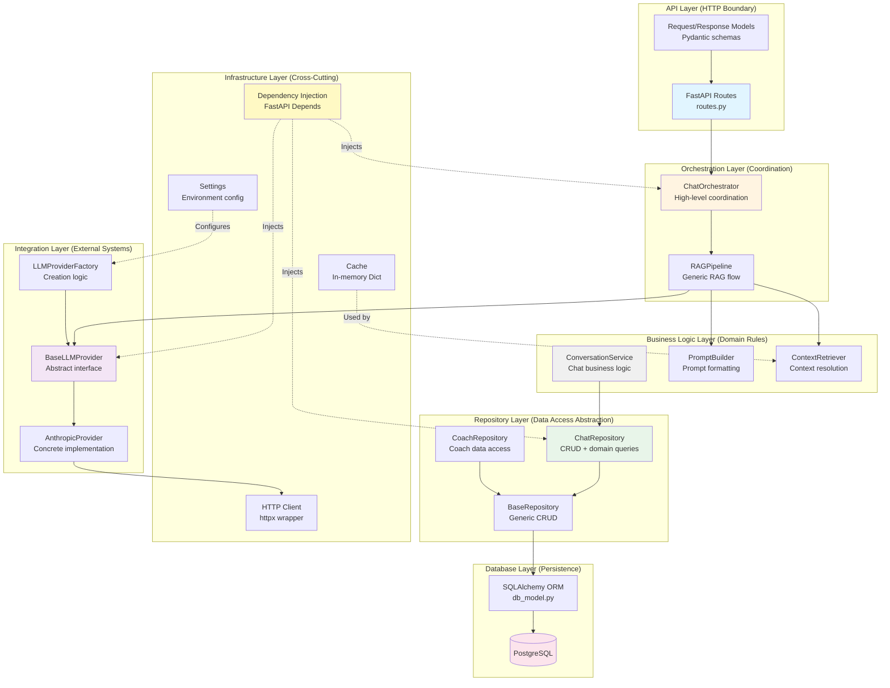

# Diagram 2: Backend Layered Architecture

## Vertical Separation of Concerns



## Dependency Flow Rules

### ✅ Allowed Dependencies (Top → Down)
- **API Layer** → Orchestration Layer
- **Orchestration Layer** → Business Logic Layer + Integration Layer
- **Business Logic Layer** → Repository Layer
- **Repository Layer** → Database Layer
- **All Layers** → Infrastructure Layer (via DI)

### ❌ Forbidden Dependencies (Bottom → Up, Horizontal)
- Database Layer **CANNOT** depend on Repository Layer
- Integration Layer **CANNOT** depend on Business Logic
- Layers **SHOULD NOT** depend on adjacent layers at same level

### 🔑 Why This Matters
- **Testability**: Can mock entire layers
- **Replaceability**: Swap implementations without touching other layers
- **Understanding**: Clear boundaries make onboarding easier

---

## Layer Responsibilities Detailed

### 1️⃣ **API Layer** (HTTP Boundary)
**Purpose**: Transform HTTP ↔ Domain concepts

**Responsibilities**:
- Route definitions (`@app.post("/chats")`)
- Request validation (Pydantic models)
- Response serialization
- HTTP-specific concerns (status codes, headers)

**Does NOT**:
- Contain business logic
- Make database calls directly
- Know about LLM providers

**Files**: `app/chat/routes.py`, `app/chat/models/api.py`

---

### 2️⃣ **Orchestration Layer** (Coordination)
**Purpose**: Coordinate multi-step workflows

**Responsibilities**:
- High-level flow control
- Calling multiple services in sequence
- Cross-domain coordination (e.g., chat + RAG + LLM)

**Pattern**: **Facade Pattern** - Simplifies complex subsystem

**Does NOT**:
- Implement business rules
- Directly access database
- Know about HTTP/API details

**Files**: `app/chat/orchestrator.py`, `app/rag/pipeline.py`

**Example**:
```python
class ChatOrchestrator:
    async def process_chat(request: ChatRequest) -> Message:
        # 1. Delegate to RAG pipeline (abstraction)
        response = await self.rag_pipeline.generate(
            messages=request.messages,
            context_query=request.contextQuery
        )
        # 2. Return result (no business logic here)
        return response
```

---

### 3️⃣ **Business Logic Layer** (Domain Rules)
**Purpose**: Enforce business rules, domain knowledge

**Responsibilities**:
- Domain-specific validation
- Business rule enforcement
- Data transformation (DTOs)
- Pure functions where possible

**Patterns**:
- **Service Pattern**: ConversationService
- **Builder Pattern**: PromptBuilder
- **Strategy Pattern**: Different retrievers

**Does NOT**:
- Know about HTTP
- Make direct database calls (uses repositories)
- Know about specific LLM providers

**Files**: `app/chat/services.py`, `app/rag/prompt_builder.py`, `app/rag/retriever.py`

**Example**:
```python
class PromptBuilder:
    # Pure function - no side effects, no dependencies
    def format_user_message(self, query: str, context: str) -> str:
        return f"Context: <data>{context}</data>\n\nUser query: {query}"
```

---

### 4️⃣ **Repository Layer** (Data Access Abstraction)
**Purpose**: Abstract database operations

**Responsibilities**:
- CRUD operations
- Query building
- ORM interaction
- DTO ↔ ORM model translation

**Patterns**:
- **Repository Pattern**: Hide persistence details
- **Template Method**: BaseRepository with generic operations

**Does NOT**:
- Contain business logic
- Know about HTTP/API
- Know about LLM providers

**Files**: `app/common/repository.py`, `app/chat/repository/chat_repository.py`

**Example**:
```python
class ChatRepository(BaseRepository[ChatHistory]):
    async def get_recent_user_chats(
        self,
        session: AsyncSession,
        user_id: str,
        days: int = 30
    ) -> List[ChatHistoryDTO]:
        # Database query logic only
        # No business rules about WHAT is recent
```

---

### 5️⃣ **Database Layer** (Persistence)
**Purpose**: Data persistence, ORM models

**Responsibilities**:
- Table definitions (SQLAlchemy models)
- Relationships, indexes, constraints
- Migrations (Alembic)

**Does NOT**:
- Contain queries (repositories do this)
- Contain business logic

**Files**: `app/common/db_model.py`, `alembic/versions/`

---

### 6️⃣ **Integration Layer** (External Systems)
**Purpose**: Abstract external dependencies

**Responsibilities**:
- External API communication
- Protocol translation (Message ↔ provider format)
- Error handling for external calls

**Patterns**:
- **Factory Pattern**: LLMProviderFactory
- **Strategy Pattern**: BaseLLMProvider
- **Adapter Pattern**: Translate to/from provider formats

**Does NOT**:
- Contain business logic
- Know about database
- Know about HTTP/API details

**Files**: `app/integrations/llm/`

**Example**:
```python
class BaseLLMProvider(ABC):
    @abstractmethod
    async def generate(self, messages: List[Message]) -> Message:
        """Generic interface - implementation details hidden"""
        pass
```

---

### 7️⃣ **Infrastructure Layer** (Cross-Cutting)
**Purpose**: Shared utilities, configuration, DI

**Responsibilities**:
- Dependency injection setup
- Configuration management
- Logging, monitoring
- Shared utilities (HTTP client, caching)

**Patterns**:
- **Dependency Injection**: Loose coupling
- **Singleton**: Application-scoped resources
- **Factory**: Client creation

**Files**: `app/startup.py`, `app/settings.py`, `app/common/clients/`, `app/common/dependencies.py`

---

## Design Principles Applied

### 🎯 **Single Responsibility Principle (SRP)**
Each layer has ONE reason to change:
- **API Layer** changes if HTTP contract changes
- **Business Logic** changes if domain rules change
- **Repository Layer** changes if data access patterns change
- **Integration Layer** changes if external API changes

### 🔒 **Dependency Inversion Principle (DIP)**
High-level modules don't depend on low-level modules:
- `RAGPipeline` depends on `BaseLLMProvider` (abstraction)
- NOT on `AnthropicProvider` (concrete implementation)

### 🔄 **Open/Closed Principle (OCP)**
Open for extension, closed for modification:
- Adding OpenAI provider: Create new class, don't modify existing code
- Adding new retriever: Implement `Retriever` protocol, pipeline unchanged

### 🧩 **Interface Segregation Principle (ISP)**
Clients shouldn't depend on interfaces they don't use:
- `Retriever` protocol has ONE method: `retrieve()`
- Not a bloated interface with unused methods

### 🎨 **Liskov Substitution Principle (LSP)**
Subclasses should be substitutable:
- Any `BaseLLMProvider` implementation can replace another
- `ChatRepository` can be used anywhere `BaseRepository[ChatHistory]` is expected

---

## Testing Strategy by Layer

### API Layer
- **Integration tests**: Full HTTP request/response cycle
- **Focus**: Serialization, validation, status codes

### Orchestration Layer
- **Unit tests** with mocked dependencies
- **Focus**: Flow control, coordination logic

### Business Logic Layer
- **Unit tests** (pure functions where possible)
- **Focus**: Business rules, edge cases

### Repository Layer
- **Integration tests** with test database
- **Focus**: Query correctness, DTO mapping

### Integration Layer
- **Unit tests** with mocked HTTP client
- **Focus**: Protocol translation, error handling
- **E2E tests**: Actual API calls (in separate test suite)

---

## Benefit Summary

| Principle | Benefit | Example in Codebase |
|-----------|---------|---------------------|
| **Layering** | Clear boundaries | Can test RAG pipeline without database |
| **DI** | Loose coupling | Swap Anthropic for OpenAI without code changes |
| **Abstraction** | Flexibility | Add vector DB retriever without touching pipeline |
| **SRP** | Maintainability | Prompt changes don't affect data access |
| **Protocols** | No inheritance hell | Retriever interface without base classes |
