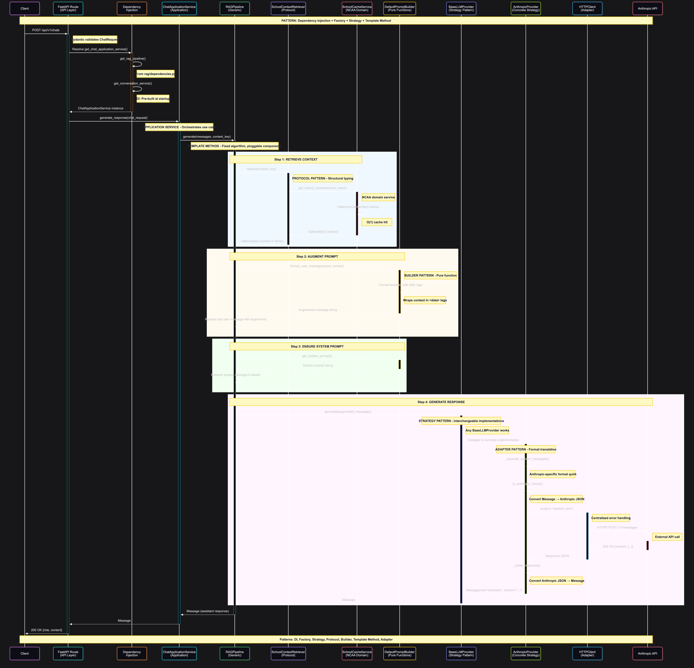

# 3: Detailed Backend Sequence with Design Patterns

## Complete Request Flow with Pattern Annotations



---

## Pattern Catalog: Why Each Pattern Exists

### 1. **Dependency Injection (DI)**
**Location**: `app/common/dependencies.py`, `app/chat/dependencies.py`, `app/rag/dependencies.py`

**Problem Solved**:
- Hard-coded dependencies make testing impossible
- Tight coupling between layers

**How It Works**:
```python
# ❌ BAD: Hard-coded dependency
class ChatApplicationService:
    def __init__(self):
        self.rag_pipeline = RAGPipeline(...)  # Tightly coupled!
        self.llm_provider = AnthropicProvider()

# ✅ GOOD: Dependency injection
class ChatApplicationService:
    def __init__(self, rag_pipeline: RAGPipeline, conversation_service: ConversationService):
        self.rag_pipeline = rag_pipeline
        self.conversation_service = conversation_service
```

**Benefits**:
- Can inject mock RAG pipeline in tests
- Swap Anthropic → OpenAI by changing one line in DI config
- No code changes in ChatApplicationService

**FastAPI Implementation**:
```python
# app/chat/dependencies.py
async def get_chat_application_service(
    rag_pipeline: RAGPipeline = Depends(get_rag_pipeline),
    conversation_service: ConversationService = Depends(get_conversation_service),
) -> ChatApplicationService:
    return ChatApplicationService(rag_pipeline, conversation_service)
```

---

### 2. **Factory Pattern**
**Location**: `app/integrations/llm/factory.py`, `app/rag/factory.py`

**Problem Solved**:
- Creating objects with complex initialization
- Selecting implementation based on configuration

**How It Works**:
```python
class LLMProviderFactory:
    provider_map = {
        "anthropic": AnthropicProvider,
        "openai": OpenAIProvider,      # Easy to add
        "cohere": CohereProvider,      # Easy to add
    }

    @staticmethod
    def create(config: LLMConfig, http_client: HTTPClient) -> BaseLLMProvider:
        provider_class = LLMProviderFactory.provider_map.get(config.PROVIDER)
        if not provider_class:
            raise ValueError(f"Unknown provider: {config.PROVIDER}")
        return provider_class(
            api_key=config.API_KEY,
            model=config.MODEL,
            http_client=http_client,
            # ... other config
        )
```

**Benefits**:
- **Adding new provider**: Just add to `provider_map`, zero changes elsewhere
- **Configuration-driven**: `PROVIDER=openai` in env switches entire implementation
- **Centralized creation logic**: Complex initialization in one place

**What Changes to Add OpenAI**:
1. Create `openai.py` with `OpenAIProvider(BaseLLMProvider)`
2. Add `"openai": OpenAIProvider` to factory map
3. Change environment variable: `LLM_PROVIDER=openai`

**Total files changed**: 1 (factory.py)
**Lines of code changed in existing files**: 1

---

### 3. **Strategy Pattern**
**Location**: `app/integrations/llm/base.py`, `app/integrations/llm/anthropic.py`

**Problem Solved**:
- Multiple algorithms for same operation (different LLM providers)
- Need to swap algorithms at runtime

**How It Works**:
```python
# Abstract strategy
class BaseLLMProvider(ABC):
    @abstractmethod
    async def generate(self, messages: List[Message]) -> Message:
        pass

# Concrete strategy A
class AnthropicProvider(BaseLLMProvider):
    async def generate(self, messages: List[Message]) -> Message:
        # Anthropic-specific implementation
        pass

# Concrete strategy B
class OpenAIProvider(BaseLLMProvider):
    async def generate(self, messages: List[Message]) -> Message:
        # OpenAI-specific implementation
        pass
```

**Usage** (client code doesn't know which strategy):
```python
async def generate_response(provider: BaseLLMProvider, messages: List[Message]):
    # Works with ANY provider - polymorphism
    response = await provider.generate(messages)
    return response
```

**Benefits**:
- **Open/Closed Principle**: New strategies without modifying existing code
- **Testability**: Easy to mock BaseLLMProvider
- **Flexibility**: Switch providers via config, not code changes

---

### 4. **Protocol Pattern** (Python-specific)
**Location**: `app/rag/pipeline.py` (Retriever and PromptBuilder protocols)

**Problem Solved**:
- Need interface without inheritance complexity
- Python's duck typing isn't type-safe

**How It Works**:
```python
# Define protocol (interface)
from typing import Protocol

class Retriever(Protocol):
    async def retrieve(self, query: str) -> Optional[str]:
        """Retrieve context for given query."""
        ...

class PromptBuilder(Protocol):
    def format_user_message(self, query: str, context: Optional[str]) -> str:
        ...
    def get_system_prompt(self) -> str:
        ...

# Implementation (NO inheritance required!)
class SchoolContextRetriever:  # Doesn't inherit from Retriever
    def __init__(self, cache_service: SchoolCacheService):
        self._cache_service = cache_service

    async def retrieve(self, query: str) -> Optional[str]:
        return await self._cache_service.get_school_context(query)  # Structural typing works!

# Another implementation
class VectorDBRetriever:  # Also doesn't inherit
    def __init__(self, vector_db):
        self.vector_db = vector_db

    async def retrieve(self, query: str) -> Optional[str]:
        # Completely different implementation
        results = await self.vector_db.search(query)
        return results[0].content if results else None
```

**Benefits**:
- **No inheritance hell**: Each retriever stands alone
- **Type safety**: MyPy checks Protocol compliance
- **Flexibility**: Any object with matching method signatures works

---

### 5. **Builder Pattern**
**Location**: `app/rag/prompt_builders/default.py`

**Problem Solved**:
- Complex prompt construction
- Keep formatting logic in one place

**How It Works**:
```python
class DefaultPromptBuilder:
    DEFAULT_SYSTEM_PROMPT = """Use the context in <data> xml tags..."""

    def __init__(self, system_prompt: Optional[str] = None):
        self.system_prompt = system_prompt or self.DEFAULT_SYSTEM_PROMPT

    def format_user_message(self, query: str, context: Optional[str]) -> str:
        """Pure function - no side effects."""
        if context:
            return f"Context: <data>{context}</data>\n\nUser query: {query}"
        return query

    def get_system_prompt(self) -> str:
        return self.system_prompt
```

**Benefits**:
- **Separation of concerns**: Prompt logic separate from generation
- **Testability**: Pure functions, easy to test
- **Reusability**: Same builder across different pipelines
- **Extensibility**: Easy to create variants (FewShotPromptBuilder, StructuredPromptBuilder)

---

### 6. **Application Service Pattern**
**Location**: `app/chat/services/chat_application.py`

**Problem Solved**:
- Use cases span multiple domain services
- Need orchestration without mixing business logic

**How It Works**:
```python
class ChatApplicationService:
    """Application Service: Orchestrates use cases across domains"""

    def __init__(self, rag_pipeline: RAGPipeline, conversation_service: ConversationService):
        self.rag_pipeline = rag_pipeline
        self.conversation_service = conversation_service

    async def generate_response(self, chat_request: ChatRequest) -> Message:
        # Orchestrates RAG pipeline (from RAG domain)
        response = await self.rag_pipeline.generate(
            messages=chat_request.messages,
            context_key=chat_request.context_key,
        )
        return response

    async def save_conversation(self, session: AsyncSession, chat_request: ChatRequest):
        # Orchestrates conversation persistence (from Chat domain)
        chat_history_dto = self._to_chat_history_dto(chat_request)
        await self.conversation_service.save_conversation(session, chat_history_dto)
```

**Benefits**:
- **Clear separation**: Use case orchestration vs domain logic
- **Reusability**: Domain services reusable by multiple use cases
- **Testability**: Mock domain services, test orchestration logic

---

### 7. **Adapter Pattern**
**Location**: `app/integrations/llm/anthropic.py`

**Problem Solved**:
- External API has incompatible interface
- Need to translate between formats

**How It Works**:
```python
class AnthropicProvider(BaseLLMProvider):
    def _to_anthropic_format(self, messages: List[Message]) -> List[dict]:
        """Adapt our Message → Anthropic format."""
        return [{"role": msg.role, "content": msg.content} for msg in messages]

    def _separate_system_messages(self, messages: List[Message]) -> tuple:
        """Anthropic-specific: system messages go in separate field."""
        system_messages = [msg.content for msg in messages if msg.role == "system"]
        non_system = [msg for msg in messages if msg.role != "system"]
        return " ".join(system_messages), non_system

    def _parse_response(self, response_data: dict) -> Message:
        """Adapt Anthropic format → our Message."""
        content = response_data["content"][0]["text"]
        return Message(role="assistant", content=content)

    async def generate(self, messages: List[Message]) -> Message:
        # Adapt request
        system, non_system = self._separate_system_messages(messages)
        anthropic_messages = self._to_anthropic_format(non_system)

        # Call external API
        response_data = await self.http_client.post(
            url=self.base_url,
            json={
                "model": self.model,
                "system": system,
                "messages": anthropic_messages,
            }
        )

        # Adapt response
        return self._parse_response(response_data)
```

**Benefits**:
- **Internal code uses generic Message**: Rest of app doesn't know about Anthropic
- **External API changes isolated**: Only adapter changes
- **Multiple providers**: Each adapter translates to/from provider format

---

### 8. **Template Method Pattern**
**Location**: `app/rag/pipeline.py`

**Problem Solved**:
- Algorithm has fixed steps
- But steps can have different implementations

**How It Works**:
```python
class RAGPipeline:
    """Template: Fixed algorithm, pluggable steps."""

    def __init__(
        self,
        retriever: Retriever,
        prompt_builder: PromptBuilder,
        llm_provider: BaseLLMProvider,
    ):
        self.retriever = retriever
        self.prompt_builder = prompt_builder
        self.llm_provider = llm_provider

    async def generate(
        self,
        messages: List[Message],
        context_key: Optional[str] = None,
    ) -> Message:
        # TEMPLATE ALGORITHM (fixed order):

        # Step 1: Retrieve (pluggable - any Retriever)
        context = await self.retriever.retrieve(context_key) if context_key else None

        # Step 2: Augment (pluggable - any PromptBuilder)
        if context and messages:
            last_message = messages[-1]
            augmented_content = self.prompt_builder.format_user_message(
                query=last_message.content,
                context=context
            )
            messages[-1] = Message(role="user", content=augmented_content)

        # Step 3: Ensure system prompt (pluggable)
        if not any(msg.role == "system" for msg in messages):
            system_prompt = self.prompt_builder.get_system_prompt()
            messages = [Message(role="system", content=system_prompt)] + messages

        # Step 4: Generate (pluggable - any BaseLLMProvider)
        response = await self.llm_provider.generate(messages)

        return response
```

**Benefits**:
- **Fixed RAG algorithm**: Always retrieve → augment → generate
- **Pluggable components**: Swap retriever, builder, provider independently
- **New RAG variants**: Subclass and override specific steps
- **Testability**: Mock individual steps

---

## Anti-Patterns Avoided

### **God Object**
**Problem**: One class does everything

**Avoided by**: Clear separation of Application Service, Domain Services, and Infrastructure

### **Tight Coupling**
**Problem**: Classes directly instantiate dependencies

**Avoided by**: Dependency injection throughout

### **Magic Strings**
**Problem**: Hard-coded values everywhere

**Avoided by**: Settings class with environment variables

### **Leaky Abstractions**
**Problem**: Implementation details leak through interfaces

**Avoided by**:
- `BaseLLMProvider` doesn't expose provider-specific methods
- `Retriever` protocol is generic (doesn't expose cache details)
- `RAGPipeline` doesn't know about SchoolCacheService

### **Inheritance Hell**
**Problem**: Deep inheritance hierarchies

**Avoided by**:
- Protocols instead of abstract base classes
- Composition over inheritance (ChatApplicationService has RAGPipeline)

---

## Real-World Impact: Adding a New Feature

### Scenario: Add OpenAI Support

**Without patterns** (tight coupling):
- Modify 10+ files
- Replace all `AnthropicProvider` references
- Update tests everywhere
- Risk breaking existing functionality

**With patterns** (this architecture):
1. Create `openai.py`:
   ```python
   class OpenAIProvider(BaseLLMProvider):
       async def generate(self, messages: List[Message]) -> Message:
           # OpenAI-specific implementation
           pass
   ```

2. Update factory (1 line):
   ```python
   provider_map = {
       "anthropic": AnthropicProvider,
       "openai": OpenAIProvider,  # ← New line
   }
   ```

3. Update environment:
   ```bash
   LLM_PROVIDER=openai
   ```

**Result**:
- **1 new file**, **1 line changed** in existing code
- **Zero changes** to ChatApplicationService, RAGPipeline, routes, repositories
- **Tests**: Only need tests for OpenAIProvider, existing tests still pass

This is the power of proper abstraction!

---

## Dependency Injection Flow

```
Request
  ↓
FastAPI Route
  ↓
Depends(get_chat_application_service)
  ↓
get_chat_application_service() in app/chat/dependencies.py
  ├─→ Depends(get_rag_pipeline) from app/rag/dependencies.py
  │    ├─→ Depends(get_retriever)
  │    │    └─→ Depends(get_school_cache_service) from app/ncaa/schools/dependencies.py
  │    │         └─→ app.state.school_cache_service (built at startup)
  │    ├─→ Depends(get_prompt_builder)
  │    │    └─→ DefaultPromptBuilder()
  │    └─→ Depends(get_llm_provider)
  │         └─→ app.state.llm_provider (built at startup)
  └─→ Depends(get_conversation_service)
       └─→ ConversationService(ChatRepository())
```

---

## Key Architectural Insights

**Strengths**:

1. **Clean Domain Separation**: NCAA, Chat, RAG, Common domains have clear boundaries
2. **Layered Architecture**: Clear separation of routes → application → domain → repository
3. **Extensibility**: Protocol-based design allows easy addition of new retrievers, builders, providers
4. **DTO Isolation**: Domain logic is decoupled from database implementation
5. **Reusable RAG Pipeline**: Generic pipeline can work with any retriever and provider
6. **Centralized DI**: ApplicationContainer manages application-scoped resources
7. **Error Handling**: Consistent HTTP exception translation across all integrations

**Pattern Summary**:
- **Dependency Injection**: Loose coupling throughout
- **Factory**: Provider creation
- **Strategy**: Interchangeable LLM providers
- **Protocol**: Retriever and PromptBuilder interfaces
- **Builder**: Prompt formatting
- **Application Service**: Use case orchestration
- **Adapter**: Format translation for external APIs
- **Template Method**: Fixed RAG algorithm with pluggable steps

This architecture demonstrates how traditional software engineering patterns apply powerfully to AI/LLM applications!
