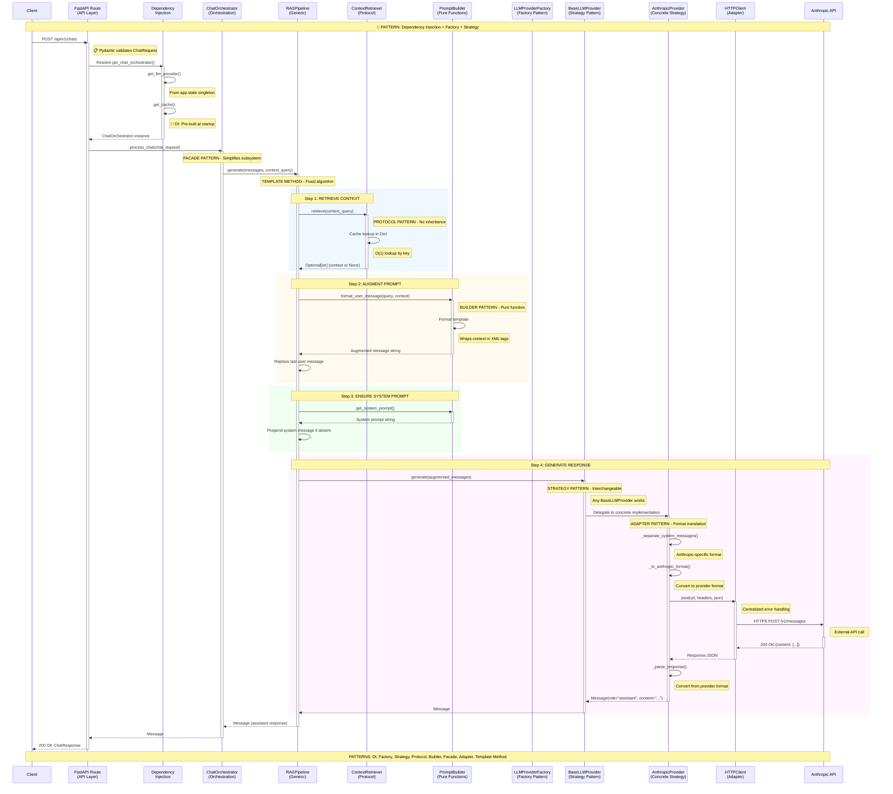

# Diagram 3: Detailed Backend Sequence with Design Patterns

## Complete Request Flow with Pattern Annotations



---

## Pattern Catalog: Why Each Pattern Exists

### 1️⃣ **Dependency Injection (DI)**
**Location**: `app/common/dependencies.py`, `app/chat/dependencies.py`

**Problem Solved**:
- Hard-coded dependencies make testing impossible
- Tight coupling between layers

**How It Works**:
```python
# ❌ BAD: Hard-coded dependency
class ChatOrchestrator:
    def __init__(self):
        self.llm_provider = AnthropicProvider()  # Tightly coupled!

# ✅ GOOD: Dependency injection
class ChatOrchestrator:
    def __init__(self, llm_provider: BaseLLMProvider):  # Abstraction injected
        self.llm_provider = llm_provider
```

**Benefits**:
- Can inject mock provider in tests
- Swap Anthropic → OpenAI by changing one line in DI config
- No code changes in ChatOrchestrator

**FastAPI Implementation**:
```python
async def get_chat_orchestrator(
    llm_provider: BaseLLMProvider = Depends(get_llm_provider),
    cache: dict = Depends(get_cache),
) -> ChatOrchestrator:
    return create_chat_orchestrator(cache, llm_provider)
```

---

### 2️⃣ **Factory Pattern**
**Location**: `app/integrations/llm/factory.py`

**Problem Solved**:
- Creating objects with complex initialization
- Selecting implementation based on configuration

**How It Works**:
```python
class LLMProviderFactory:
    provider_map = {
        "anthropic": AnthropicProvider,
        "openai": OpenAIProvider,      # Easy to add
        "cohere": CohereProvider,      # Easy to add
    }

    @staticmethod
    def create(config: LLMConfig, http_client: HTTPClient) -> BaseLLMProvider:
        provider_class = LLMProviderFactory.provider_map.get(config.PROVIDER)
        if not provider_class:
            raise ValueError(f"Unknown provider: {config.PROVIDER}")
        return provider_class(
            api_key=config.API_KEY,
            model=config.MODEL,
            # ... other config
        )
```

**Benefits**:
- **Adding new provider**: Just add to `provider_map`, zero changes elsewhere
- **Configuration-driven**: `PROVIDER=openai` in env switches entire implementation
- **Centralized creation logic**: Complex initialization in one place

**What Changes to Add OpenAI**:
1. Create `openai.py` with `OpenAIProvider(BaseLLMProvider)`
2. Add `"openai": OpenAIProvider` to factory map
3. Change environment variable: `LLM_PROVIDER=openai`

**Total files changed**: 1 (factory.py)
**Lines of code changed in existing files**: 1

---

### 3️⃣ **Strategy Pattern**
**Location**: `app/integrations/llm/base.py`, `app/integrations/llm/anthropic.py`

**Problem Solved**:
- Multiple algorithms for same operation (different LLM providers)
- Need to swap algorithms at runtime

**How It Works**:
```python
# Abstract strategy
class BaseLLMProvider(ABC):
    @abstractmethod
    async def generate(self, messages: List[Message]) -> Message:
        pass

# Concrete strategy A
class AnthropicProvider(BaseLLMProvider):
    async def generate(self, messages: List[Message]) -> Message:
        # Anthropic-specific implementation
        pass

# Concrete strategy B
class OpenAIProvider(BaseLLMProvider):
    async def generate(self, messages: List[Message]) -> Message:
        # OpenAI-specific implementation
        pass
```

**Usage** (client code doesn't know which strategy):
```python
async def generate_response(provider: BaseLLMProvider, messages: List[Message]):
    # Works with ANY provider - polymorphism
    response = await provider.generate(messages)
    return response
```

**Benefits**:
- **Open/Closed Principle**: New strategies without modifying existing code
- **Testability**: Easy to mock BaseLLMProvider
- **Flexibility**: Switch providers via config, not code changes

---

### 4️⃣ **Protocol Pattern** (Python-specific)
**Location**: `app/rag/pipeline.py` (Retriever protocol)

**Problem Solved**:
- Need interface without inheritance complexity
- Python's duck typing isn't type-safe

**How It Works**:
```python
# Define protocol (interface)
from typing import Protocol

class Retriever(Protocol):
    async def retrieve(self, query: str) -> Optional[str]:
        """Retrieve context for given query."""
        ...

# Implementation (NO inheritance required!)
class ContextRetriever:  # Doesn't inherit from Retriever
    def __init__(self, cache: Dict[str, str]):
        self.cache = cache

    async def retrieve(self, query: str) -> Optional[str]:
        return self.cache.get(query)  # Structural typing - it just works!

# Another implementation
class VectorDBRetriever:  # Also doesn't inherit
    def __init__(self, embedding_model, vector_db):
        self.embedding_model = embedding_model
        self.vector_db = vector_db

    async def retrieve(self, query: str) -> Optional[str]:
        # Completely different implementation
        embedding = await self.embedding_model.embed(query)
        results = await self.vector_db.search(embedding)
        return results[0].content if results else None
```

**Benefits**:
- **No inheritance hell**: Each retriever stands alone
- **Type safety**: MyPy checks Protocol compliance
- **Flexibility**: Any object with `retrieve(query: str)` method works

**Comparison**:
```python
# ❌ With inheritance (rigid)
class BaseRetriever(ABC):
    @abstractmethod
    async def retrieve(self, query: str) -> Optional[str]:
        pass

class ContextRetriever(BaseRetriever):  # Must inherit
    # Now coupled to base class
    pass

# ✅ With Protocol (flexible)
class ContextRetriever:  # No inheritance
    async def retrieve(self, query: str) -> Optional[str]:
        # Just implement the method
        pass
```

---

### 5️⃣ **Builder Pattern**
**Location**: `app/rag/prompt_builder.py`

**Problem Solved**:
- Complex prompt construction
- Keep formatting logic in one place

**How It Works**:
```python
class PromptBuilder:
    def __init__(self, system_prompt: str = DEFAULT_SYSTEM_PROMPT):
        self.system_prompt = system_prompt

    def format_user_message(self, query: str, context: Optional[str]) -> str:
        """Pure function - no side effects."""
        if context:
            return f"Context: <data>{context}</data>\n\nUser query: {query}"
        return query

    def get_system_prompt(self) -> str:
        return self.system_prompt

    def set_system_prompt(self, prompt: str) -> None:
        self.system_prompt = prompt
```

**Benefits**:
- **Separation of concerns**: Prompt logic separate from generation
- **Testability**: Pure functions, easy to test
- **Reusability**: Same builder across different pipelines

**Why NOT a complex builder?**
```python
# ❌ Over-engineered
class PromptBuilder:
    def add_context(self): return self
    def add_examples(self): return self
    def add_instructions(self): return self
    def build(self): return self.prompt

# ✅ Simple, focused
class PromptBuilder:
    def format_user_message(self, query, context): ...
```

---

### 6️⃣ **Facade Pattern**
**Location**: `app/chat/orchestrator.py`

**Problem Solved**:
- Complex subsystem (RAG + LLM + caching) needs simple interface
- Client shouldn't know about all internal details

**How It Works**:
```python
class ChatOrchestrator:
    """Facade: Simplifies complex RAG subsystem."""

    def __init__(self, rag_pipeline: RAGPipeline):
        self.rag_pipeline = rag_pipeline

    async def process_chat(self, request: ChatRequest) -> Message:
        # Hide complexity - client just calls process_chat()
        response = await self.rag_pipeline.generate(
            messages=request.messages,
            context_query=request.contextQuery,
        )
        return response
```

**Without Facade** (client code):
```python
# ❌ Client must understand RAG internals
retriever = ContextRetriever(cache)
prompt_builder = PromptBuilder()
llm_provider = get_llm_provider()
rag_pipeline = RAGPipeline(retriever, prompt_builder, llm_provider)

# Complex setup...
context = await retriever.retrieve(context_query)
augmented = prompt_builder.format_user_message(query, context)
response = await llm_provider.generate([augmented])
```

**With Facade** (client code):
```python
# ✅ Client just calls one method
response = await orchestrator.process_chat(request)
```

---

### 7️⃣ **Adapter Pattern**
**Location**: `app/integrations/llm/anthropic.py`

**Problem Solved**:
- External API has incompatible interface
- Need to translate between formats

**How It Works**:
```python
class AnthropicProvider(BaseLLMProvider):
    def _to_anthropic_format(self, messages: List[Message]) -> List[dict]:
        """Adapt our Message → Anthropic format."""
        return [{"role": msg.role, "content": msg.content} for msg in messages]

    def _parse_response(self, response_data: dict) -> Message:
        """Adapt Anthropic format → our Message."""
        content = response_data["content"][0]["text"]
        return Message(role="assistant", content=content)

    async def generate(self, messages: List[Message]) -> Message:
        # Adapt request
        anthropic_messages = self._to_anthropic_format(messages)

        # Call external API
        response_data = await self.http_client.post(...)

        # Adapt response
        return self._parse_response(response_data)
```

**Benefits**:
- **Internal code uses generic Message**: Rest of app doesn't know about Anthropic
- **External API changes isolated**: Only adapter changes
- **Multiple providers**: Each adapter translates to/from provider format

---

### 8️⃣ **Template Method Pattern**
**Location**: `app/rag/pipeline.py`

**Problem Solved**:
- Algorithm has fixed steps
- But steps can have different implementations

**How It Works**:
```python
class RAGPipeline:
    """Template: Fixed algorithm, pluggable steps."""

    async def generate(
        self,
        messages: List[Message],
        context_query: Optional[str] = None,
    ) -> Message:
        # TEMPLATE ALGORITHM (fixed order):

        # Step 1: Retrieve (pluggable - any Retriever)
        context = await self.retriever.retrieve(context_query) if context_query else None

        # Step 2: Augment (pluggable - any PromptBuilder)
        if context and messages:
            last_message = messages[-1]
            augmented_content = self.prompt_builder.format_user_message(
                query=last_message.content,
                context=context
            )
            messages[-1] = Message(role="user", content=augmented_content)

        # Step 3: Ensure system prompt (pluggable)
        if not any(msg.role == "system" for msg in messages):
            system_prompt = self.prompt_builder.get_system_prompt()
            messages = [Message(role="system", content=system_prompt)] + messages

        # Step 4: Generate (pluggable - any BaseLLMProvider)
        response = await self.llm_provider.generate(
            messages=messages,
            temperature=self.temperature,
            max_tokens=self.max_tokens,
        )

        return response
```

**Benefits**:
- **Fixed RAG algorithm**: Always retrieve → augment → generate
- **Pluggable components**: Swap retriever, builder, provider independently
- **New RAG variants**: Subclass and override specific steps

---

## Anti-Patterns Avoided

### ❌ **God Object**
**Problem**: One class does everything

**Avoided by**: Layered architecture with SRP

### ❌ **Tight Coupling**
**Problem**: Classes directly instantiate dependencies

**Avoided by**: Dependency injection throughout

### ❌ **Magic Strings**
**Problem**: Hard-coded values everywhere

**Avoided by**: Settings class with environment variables

### ❌ **Leaky Abstractions**
**Problem**: Implementation details leak through interfaces

**Avoided by**:
- `BaseLLMProvider` doesn't expose provider-specific methods
- `Retriever` protocol is generic (doesn't expose cache details)

### ❌ **Inheritance Hell**
**Problem**: Deep inheritance hierarchies

**Avoided by**:
- Protocols instead of abstract base classes
- Composition over inheritance (ChatOrchestrator has RAGPipeline)

---

## Real-World Impact: Adding a New Feature

### Scenario: Add OpenAI Support

**Without patterns** (tight coupling):
- Modify 10+ files
- Replace all `AnthropicProvider` references
- Update tests everywhere
- Risk breaking existing functionality

**With patterns** (this architecture):
1. Create `openai.py`:
   ```python
   class OpenAIProvider(BaseLLMProvider):
       async def generate(self, messages: List[Message]) -> Message:
           # OpenAI-specific implementation
   ```

2. Update factory (1 line):
   ```python
   provider_map = {
       "anthropic": AnthropicProvider,
       "openai": OpenAIProvider,  # ← New line
   }
   ```

3. Update environment:
   ```bash
   LLM_PROVIDER=openai
   ```

**Result**:
- **1 new file**, **1 line changed** in existing code
- **Zero changes** to orchestrator, pipeline, routes, repositories
- **Tests**: Only need tests for OpenAIProvider, existing tests still pass

This is the power of proper abstraction! 🎉
