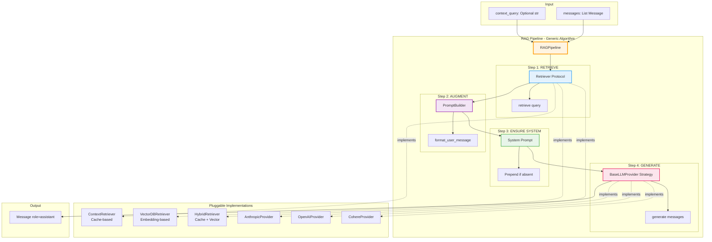
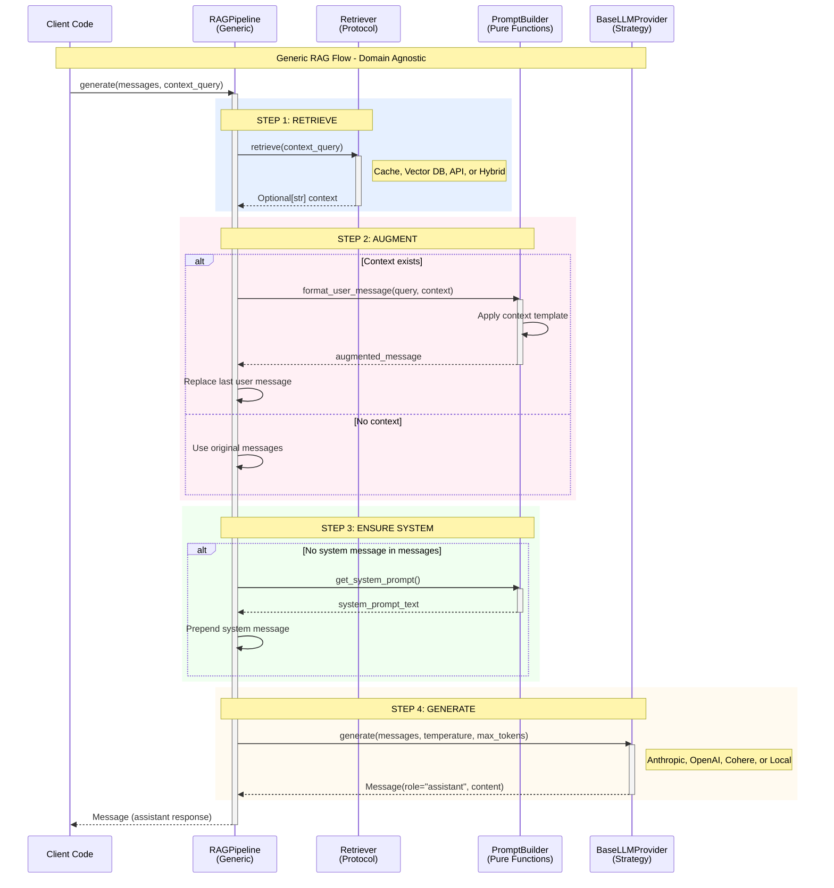

# Diagram 4: RAG Pipeline Abstraction

## Generic RAG Architecture



---

## Detailed Flow Breakdown



---

## Why This Is Generic (Not Special-Cased)

### ✅ **Domain-Agnostic Design**

The RAG pipeline doesn't know about:
- **What** the context is (school info, product data, legal docs)
- **Where** the context comes from (cache, vector DB, API)
- **How** the LLM works (Anthropic, OpenAI, local model)

**Contrast with Special-Cased Design**:

```python
# ❌ BAD: Special-cased for schools
class SchoolChatPipeline:
    async def generate(self, messages, school_name: str):
        # Hard-coded to school domain
        school_context = await self.school_repository.get_school(school_name)
        prompt = f"About {school_name}: {school_context.info}\n\nUser: {messages[-1]}"

        # Hard-coded to Anthropic
        response = await anthropic_client.messages.create(
            model="claude-3-5-sonnet",
            messages=[{"role": "user", "content": prompt}]
        )
        return response.content[0].text

# ✅ GOOD: Generic RAG pipeline
class RAGPipeline:
    async def generate(self, messages, context_query: Optional[str]):
        # Generic - works for ANY domain
        context = await self.retriever.retrieve(context_query) if context_query else None

        # Generic - works with ANY template
        if context:
            augmented = self.prompt_builder.format_user_message(messages[-1].content, context)
            messages[-1] = Message(role="user", content=augmented)

        # Generic - works with ANY LLM provider
        return await self.llm_provider.generate(messages)
```

---

## Pluggable Components

### **1. Retriever Protocol** (Context Source)

**Interface**:
```python
class Retriever(Protocol):
    async def retrieve(self, query: str) -> Optional[str]:
        """Retrieve context for query."""
        ...
```

**Multiple Implementations**:

#### A. Cache-Based Retriever (Current)
```python
class ContextRetriever:
    def __init__(self, cache: Dict[str, str]):
        self.cache = cache  # Simple dict: {query → context}

    async def retrieve(self, query: str) -> Optional[str]:
        return self.cache.get(query)  # O(1) lookup
```

**Use case**: Known queries, pre-computed contexts (schools, products)

---

#### B. Vector DB Retriever (Future)
```python
class VectorDBRetriever:
    def __init__(self, embedding_model, vector_db):
        self.embedding_model = embedding_model
        self.vector_db = vector_db

    async def retrieve(self, query: str) -> Optional[str]:
        # Semantic search
        embedding = await self.embedding_model.embed(query)
        results = await self.vector_db.search(embedding, top_k=5)

        # Combine top results
        return "\n\n".join([r.content for r in results])
```

**Use case**: Semantic search over documents, unknown queries

---

#### C. Hybrid Retriever (Advanced)
```python
class HybridRetriever:
    def __init__(self, cache: Dict, vector_db, reranker):
        self.cache = cache
        self.vector_db = vector_db
        self.reranker = reranker

    async def retrieve(self, query: str) -> Optional[str]:
        # Try cache first (fast path)
        if cached := self.cache.get(query):
            return cached

        # Fall back to vector search
        vector_results = await self.vector_db.search(query, top_k=10)

        # Rerank for relevance
        reranked = await self.reranker.rerank(query, vector_results)
        return "\n\n".join([r.content for r in reranked[:3]])
```

**Use case**: Best of both worlds - speed + semantic search

---

#### D. API-Based Retriever
```python
class APIRetriever:
    def __init__(self, api_client):
        self.api_client = api_client

    async def retrieve(self, query: str) -> Optional[str]:
        # Fetch from external API
        response = await self.api_client.get(f"/context?q={query}")
        return response.get("context")
```

**Use case**: Dynamic context from external systems

---

### **2. PromptBuilder** (Formatting Logic)

**Current Implementation**:
```python
class PromptBuilder:
    def format_user_message(self, query: str, context: Optional[str]) -> str:
        if context:
            return f"Context: <data>{context}</data>\n\nUser query: {query}"
        return query

    def get_system_prompt(self) -> str:
        return self.system_prompt
```

**Alternative Implementations**:

#### A. Few-Shot PromptBuilder
```python
class FewShotPromptBuilder(PromptBuilder):
    def __init__(self, examples: List[Tuple[str, str]]):
        self.examples = examples

    def format_user_message(self, query: str, context: Optional[str]) -> str:
        examples_text = "\n\n".join([
            f"Example {i+1}:\nQ: {q}\nA: {a}"
            for i, (q, a) in enumerate(self.examples)
        ])

        context_text = f"Context: <data>{context}</data>\n\n" if context else ""
        return f"{examples_text}\n\n{context_text}User query: {query}"
```

#### B. Structured PromptBuilder
```python
class StructuredPromptBuilder(PromptBuilder):
    def format_user_message(self, query: str, context: Optional[str]) -> str:
        # Use JSON schema for structured output
        schema = {
            "type": "object",
            "properties": {
                "answer": {"type": "string"},
                "confidence": {"type": "number"},
                "sources": {"type": "array"}
            }
        }

        context_text = f"Context: {context}\n\n" if context else ""
        return f"{context_text}Query: {query}\n\nRespond in JSON: {json.dumps(schema)}"
```

---

### **3. BaseLLMProvider** (Generation Strategy)

**Interface**:
```python
class BaseLLMProvider(ABC):
    @abstractmethod
    async def generate(self, messages: List[Message], **kwargs) -> Message:
        pass
```

**Multiple Implementations**:

#### A. Anthropic Provider (Current)
```python
class AnthropicProvider(BaseLLMProvider):
    async def generate(self, messages, temperature=0.7, max_tokens=1024):
        # Translate to Anthropic format
        system_messages, non_system = self._separate_system_messages(messages)
        anthropic_messages = self._to_anthropic_format(non_system)

        # Call Anthropic API
        response = await self.http_client.post(
            url=self.base_url,
            json={
                "model": self.model,
                "messages": anthropic_messages,
                "system": system_messages,
                "temperature": temperature,
                "max_tokens": max_tokens,
            }
        )

        # Translate back to generic Message
        return self._parse_response(response)
```

#### B. OpenAI Provider (Future)
```python
class OpenAIProvider(BaseLLMProvider):
    async def generate(self, messages, temperature=0.7, max_tokens=1024):
        # OpenAI includes system in messages array
        openai_messages = [
            {"role": msg.role, "content": msg.content}
            for msg in messages
        ]

        response = await self.http_client.post(
            url=self.base_url,
            json={
                "model": self.model,
                "messages": openai_messages,
                "temperature": temperature,
                "max_tokens": max_tokens,
            }
        )

        content = response["choices"][0]["message"]["content"]
        return Message(role="assistant", content=content)
```

#### C. Local LLM Provider (Self-hosted)
```python
class LocalLLMProvider(BaseLLMProvider):
    def __init__(self, model_path: str):
        self.model = load_model(model_path)

    async def generate(self, messages, temperature=0.7, max_tokens=1024):
        # Local inference
        prompt = self._messages_to_prompt(messages)
        output = await self.model.generate(
            prompt=prompt,
            temperature=temperature,
            max_length=max_tokens,
        )
        return Message(role="assistant", content=output)
```

---

## Benefits of Generic Design

### 1️⃣ **Extensibility Without Modification (Open/Closed Principle)**

Adding new capabilities requires **zero changes** to existing code:

| New Feature | What to Add | Files Changed |
|-------------|-------------|---------------|
| Vector DB retrieval | New `VectorDBRetriever` class | 0 existing files |
| OpenAI support | New `OpenAIProvider` class + factory entry | 1 line in factory |
| Few-shot prompting | New `FewShotPromptBuilder` | 0 existing files |
| Streaming responses | Add `stream()` method to providers | 0 changes to pipeline |

---

### 2️⃣ **Testability**

Each component can be tested in isolation:

```python
# Test pipeline with mocks
async def test_rag_pipeline():
    # Mock retriever
    mock_retriever = Mock(spec=Retriever)
    mock_retriever.retrieve.return_value = "test context"

    # Mock provider
    mock_provider = Mock(spec=BaseLLMProvider)
    mock_provider.generate.return_value = Message(role="assistant", content="test")

    # Real pipeline, mocked dependencies
    pipeline = RAGPipeline(
        retriever=mock_retriever,
        prompt_builder=PromptBuilder(),
        llm_provider=mock_provider,
    )

    result = await pipeline.generate([Message(role="user", content="test")])
    assert result.content == "test"
```

---

### 3️⃣ **Reusability Across Domains**

Same pipeline, different contexts:

```python
# Chat about schools
school_pipeline = RAGPipeline(
    retriever=ContextRetriever(school_cache),
    prompt_builder=PromptBuilder("Use school context to answer"),
    llm_provider=anthropic_provider,
)

# Chat about products
product_pipeline = RAGPipeline(
    retriever=VectorDBRetriever(product_embeddings),
    prompt_builder=PromptBuilder("Use product context to answer"),
    llm_provider=anthropic_provider,  # Same provider!
)

# Legal Q&A
legal_pipeline = RAGPipeline(
    retriever=HybridRetriever(legal_cache, legal_vector_db),
    prompt_builder=StructuredPromptBuilder(),  # Different builder
    llm_provider=openai_provider,  # Different provider!
)
```

---

### 4️⃣ **Configuration-Driven Behavior**

Change behavior via config, not code:

```yaml
# config.yaml
rag:
  retriever:
    type: "vector_db"  # or "cache" or "hybrid"
    params:
      top_k: 5

  prompt_builder:
    type: "few_shot"  # or "structured" or "default"
    examples: [...]

  llm_provider:
    type: "anthropic"  # or "openai" or "local"
    model: "claude-3-5-sonnet"
```

Factory reads config → creates components → injects into pipeline

---

## Anti-Pattern: Special-Cased Design

### ❌ What NOT to do

```python
class ChatService:
    async def chat_about_schools(self, school_name: str, message: str):
        # Special-cased for schools
        school = await self.db.get_school(school_name)
        prompt = f"School: {school.name}\nInfo: {school.context}\n\nUser: {message}"

        # Hard-coded to Anthropic
        response = await self.anthropic.create(
            model="claude-3-5-sonnet",
            messages=[{"role": "user", "content": prompt}]
        )
        return response.content[0].text

    async def chat_about_products(self, product_id: str, message: str):
        # Duplicated logic - different domain
        product = await self.db.get_product(product_id)
        prompt = f"Product: {product.name}\nInfo: {product.description}\n\nUser: {message}"

        # Same hard-coded provider
        response = await self.anthropic.create(
            model="claude-3-5-sonnet",
            messages=[{"role": "user", "content": prompt}]
        )
        return response.content[0].text

    # What if we want to use OpenAI? Rewrite everything!
    # What if we want vector search? Rewrite everything!
```

**Problems**:
- Duplicated code for each domain
- Can't swap LLM providers without rewriting
- Can't swap retrieval strategies
- Hard to test (tightly coupled to Anthropic + DB)

---

## Summary: Generic > Special-Cased

| Aspect | Special-Cased | Generic (This Design) |
|--------|---------------|----------------------|
| **Adding domain** | Copy/paste method, modify | Inject different retriever |
| **Changing LLM** | Find/replace all calls | Change factory config |
| **Adding retrieval** | Rewrite data access | Implement Retriever protocol |
| **Testing** | Mock Anthropic + DB | Mock interfaces |
| **Maintenance** | Every domain breaks separately | Fix once, all domains work |
| **Lines of code** | N × complexity | O(1) complexity |

**Key Insight**:
> "A generic, well-abstracted system is **easier to maintain** than specialized code, even though it requires more upfront design thinking."

This is the heart of your YouTube series message! 🎯
