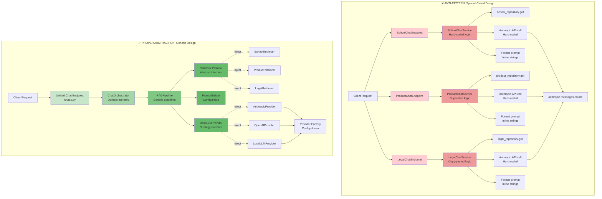

# Diagram 5: Anti-Pattern vs. Proper Abstraction

## Side-by-Side Comparison: Special-Cased vs. Generic Design



---

## Code Comparison: The Real Difference

### ❌ **Anti-Pattern: Special-Cased Implementation**

```python
# app/chat/school_chat.py
class SchoolChatService:
    def __init__(self, db, anthropic_client):
        self.db = db
        self.anthropic = anthropic_client

    async def chat(self, school_name: str, messages: List[dict]):
        # Hard-coded to school domain
        school = await self.db.query(School).filter_by(name=school_name).first()
        if not school:
            raise ValueError("School not found")

        # Hard-coded prompt format
        context = f"""
        School: {school.name}
        Division: {school.division}
        Info: {school.context}
        """

        # Hard-coded to Anthropic
        prompt = f"{context}\n\nUser: {messages[-1]['content']}"
        response = await self.anthropic.messages.create(
            model="claude-3-5-sonnet-20241022",
            messages=[{"role": "user", "content": prompt}],
            temperature=0.7,
            max_tokens=1024,
        )

        return response.content[0].text


# app/chat/product_chat.py - DUPLICATED CODE!
class ProductChatService:
    def __init__(self, db, anthropic_client):
        self.db = db
        self.anthropic = anthropic_client

    async def chat(self, product_id: str, messages: List[dict]):
        # Same pattern, different domain (copy-paste)
        product = await self.db.query(Product).filter_by(id=product_id).first()
        if not product:
            raise ValueError("Product not found")

        # Same pattern, different strings
        context = f"""
        Product: {product.name}
        Category: {product.category}
        Description: {product.description}
        """

        # Same hard-coded Anthropic call
        prompt = f"{context}\n\nUser: {messages[-1]['content']}"
        response = await self.anthropic.messages.create(
            model="claude-3-5-sonnet-20241022",
            messages=[{"role": "user", "content": prompt}],
            temperature=0.7,
            max_tokens=1024,
        )

        return response.content[0].text


# app/routes.py - Separate endpoints for each domain
@app.post("/chat/schools")
async def school_chat(request: SchoolChatRequest):
    service = SchoolChatService(db, anthropic_client)
    return await service.chat(request.school_name, request.messages)

@app.post("/chat/products")
async def product_chat(request: ProductChatRequest):
    service = ProductChatService(db, anthropic_client)
    return await service.chat(request.product_id, request.messages)

# Add legal chat? Copy-paste AGAIN!
```

**Problems**:
1. **Code duplication** - Same logic repeated 3+ times
2. **Tight coupling** - Can't swap Anthropic for OpenAI without rewriting every service
3. **Hard to test** - Must mock Anthropic client in every test
4. **Maintenance nightmare** - Bug fix requires updating all services
5. **No extensibility** - Want vector search? Rewrite everything
6. **Inline strings** - Prompt changes scattered across codebase

**What if requirements change?**
- Switch to OpenAI: **Rewrite 3+ services**
- Add streaming: **Modify 3+ services**
- Change prompt format: **Update 3+ string literals**
- Add caching: **Add to each service separately**

---

### ✅ **Proper Abstraction: Generic Design**

```python
# app/rag/pipeline.py - ONE generic implementation
class RAGPipeline:
    """Generic RAG pipeline - domain-agnostic."""

    def __init__(
        self,
        retriever: Retriever,           # Protocol - any implementation works
        prompt_builder: PromptBuilder,  # Configurable formatting
        llm_provider: BaseLLMProvider,  # Strategy - any provider works
    ):
        self.retriever = retriever
        self.prompt_builder = prompt_builder
        self.llm_provider = llm_provider

    async def generate(
        self,
        messages: List[Message],
        context_query: Optional[str] = None,
    ) -> Message:
        # Generic algorithm - works for ANY domain

        # Step 1: Retrieve (works with ANY retriever)
        context = await self.retriever.retrieve(context_query) if context_query else None

        # Step 2: Augment (works with ANY builder)
        if context and messages:
            last_message = messages[-1]
            augmented = self.prompt_builder.format_user_message(
                query=last_message.content,
                context=context
            )
            messages[-1] = Message(role="user", content=augmented)

        # Step 3: Ensure system prompt
        if not any(msg.role == "system" for msg in messages):
            system_prompt = self.prompt_builder.get_system_prompt()
            messages = [Message(role="system", content=system_prompt)] + messages

        # Step 4: Generate (works with ANY provider)
        return await self.llm_provider.generate(messages)


# app/rag/retriever.py - Protocol interface
class Retriever(Protocol):
    """Any class with retrieve() method works."""
    async def retrieve(self, query: str) -> Optional[str]: ...


# app/integrations/llm/base.py - Strategy interface
class BaseLLMProvider(ABC):
    """Any provider implementing generate() works."""
    @abstractmethod
    async def generate(self, messages: List[Message]) -> Message: ...


# Domain-specific retrievers (separate concerns)
class SchoolRetriever:
    def __init__(self, cache: Dict[str, str]):
        self.cache = cache

    async def retrieve(self, query: str) -> Optional[str]:
        return self.cache.get(query)  # Simple lookup


class ProductVectorRetriever:
    def __init__(self, vector_db):
        self.vector_db = vector_db

    async def retrieve(self, query: str) -> Optional[str]:
        results = await self.vector_db.search(query)
        return results[0].content if results else None


# Provider implementations (separate concerns)
class AnthropicProvider(BaseLLMProvider):
    async def generate(self, messages: List[Message]) -> Message:
        # Anthropic-specific logic isolated here
        response = await self.http_client.post(...)
        return self._parse_response(response)


class OpenAIProvider(BaseLLMProvider):
    async def generate(self, messages: List[Message]) -> Message:
        # OpenAI-specific logic isolated here
        response = await self.http_client.post(...)
        return Message(role="assistant", content=response["choices"][0]["message"]["content"])


# app/routes.py - ONE unified endpoint
@app.post("/api/v1/chats")
async def post_chat(
    request: ChatRequest,
    orchestrator: ChatOrchestrator = Depends(get_chat_orchestrator),
):
    """Works for ALL domains - schools, products, legal, etc."""
    response = await orchestrator.process_chat(request)
    return response


# app/startup.py - Dependency injection (configuration)
class ApplicationContainer:
    async def initialize(self):
        # Build components based on config
        cache = await self._init_cache()

        # Create retriever (could be ANY implementation)
        retriever = ContextRetriever(cache)  # Or VectorDBRetriever, or HybridRetriever

        # Create provider (could be ANY implementation)
        llm_provider = LLMProviderFactory.create(config, http_client)  # Anthropic, OpenAI, etc.

        # Create prompt builder
        prompt_builder = PromptBuilder()

        # Inject into pipeline
        rag_pipeline = RAGPipeline(retriever, prompt_builder, llm_provider)

        # Inject into orchestrator
        orchestrator = ChatOrchestrator(rag_pipeline)

        # Store in app state for dependency injection
        app.state.orchestrator = orchestrator
```

**Benefits**:
1. **Zero duplication** - One implementation for all domains
2. **Loose coupling** - Swap providers via config, not code changes
3. **Easy testing** - Mock interfaces, not concrete implementations
4. **Single fix point** - Bug fix applies to all domains automatically
5. **Extensible** - Add new retriever/provider without touching existing code
6. **Centralized formatting** - Prompt changes in one place (PromptBuilder)

**What if requirements change?**
- Switch to OpenAI: **Change 1 line in config** (`LLM_PROVIDER=openai`)
- Add streaming: **Add method to BaseLLMProvider**, implementations override
- Change prompt format: **Update PromptBuilder** (1 file)
- Add caching: **Create CachedRetriever** wrapper (0 changes to existing code)

---

## Impact Analysis: Adding a New Feature

### Scenario: Add Vector Database Search

#### ❌ **With Special-Cased Design**

**Files to modify**:
1. `SchoolChatService` - Add vector DB query logic
2. `ProductChatService` - Copy-paste vector DB logic
3. `LegalChatService` - Copy-paste vector DB logic
4. `school_chat_test.py` - Update all tests
5. `product_chat_test.py` - Update all tests
6. `legal_chat_test.py` - Update all tests

**Lines of code changed**: **300-500 lines** across 6+ files

**Risk**: Breaking existing functionality in multiple places

---

#### ✅ **With Generic Design**

**Files to modify**:
1. Create `app/rag/vector_retriever.py` - New implementation

**New file** (~50 lines):
```python
class VectorDBRetriever:
    def __init__(self, vector_db, embedding_model):
        self.vector_db = vector_db
        self.embedding_model = embedding_model

    async def retrieve(self, query: str) -> Optional[str]:
        embedding = await self.embedding_model.embed(query)
        results = await self.vector_db.search(embedding, top_k=5)
        return "\n\n".join([r.content for r in results])
```

2. Update `app/startup.py` - Change injection (1 line)
```python
# retriever = ContextRetriever(cache)  # Old
retriever = VectorDBRetriever(vector_db, embedding_model)  # New
```

**Lines of code changed**: **50 new lines + 1 modified line**

**Risk**: Zero risk to existing code (only new code added)

---

## Maintenance Over Time

### Scenario: 2 Years Later, Need to Change Prompt Format

#### ❌ **Special-Cased Design**

**Developer task**:
1. Find all services with chat logic (grep? ask senior dev?)
2. Identify which string literals are prompts
3. Update each service separately
4. Ensure consistent formatting across all
5. Test each service separately
6. Hope you didn't miss any

**Estimate**: **3-4 hours**

**Risk**: Inconsistent prompts, missed services

---

#### ✅ **Generic Design**

**Developer task**:
1. Open `app/rag/prompt_builder.py`
2. Update `format_user_message()` method
3. Run test suite (all domains tested automatically)

**Estimate**: **15 minutes**

**Risk**: None (single source of truth)

---

## Testing Complexity

### ❌ **Special-Cased Design**

```python
# Must test EACH service separately with full mocking
async def test_school_chat_service():
    mock_db = Mock()
    mock_db.query.return_value.filter_by.return_value.first.return_value = School(
        name="Stanford", division="D1", context="..."
    )

    mock_anthropic = Mock()
    mock_anthropic.messages.create.return_value = Mock(content=[Mock(text="response")])

    service = SchoolChatService(mock_db, mock_anthropic)
    result = await service.chat("Stanford", [{"role": "user", "content": "test"}])

    # Verify Anthropic was called with correct format
    mock_anthropic.messages.create.assert_called_once_with(
        model="claude-3-5-sonnet-20241022",
        messages=[{"role": "user", "content": "School: Stanford\nDivision: D1\nInfo: ...\n\nUser: test"}],
        temperature=0.7,
        max_tokens=1024,
    )


# Repeat for ProductChatService, LegalChatService, etc.
# EVERY test must mock Anthropic client
```

**Test count for 3 domains**: **3× separate test suites**

---

### ✅ **Generic Design**

```python
# Test pipeline ONCE with mocked interfaces
async def test_rag_pipeline():
    mock_retriever = Mock(spec=Retriever)
    mock_retriever.retrieve.return_value = "test context"

    mock_provider = Mock(spec=BaseLLMProvider)
    mock_provider.generate.return_value = Message(role="assistant", content="response")

    pipeline = RAGPipeline(
        retriever=mock_retriever,
        prompt_builder=PromptBuilder(),
        llm_provider=mock_provider,
    )

    result = await pipeline.generate([Message(role="user", content="test")], "query")

    assert result.content == "response"
    mock_retriever.retrieve.assert_called_once_with("query")


# Test each retriever independently (no LLM mocking needed)
async def test_school_retriever():
    cache = {"Stanford": "context"}
    retriever = SchoolRetriever(cache)

    result = await retriever.retrieve("Stanford")
    assert result == "context"


# Test each provider independently (no retriever mocking needed)
async def test_anthropic_provider():
    mock_http = Mock()
    mock_http.post.return_value = {"content": [{"text": "response"}]}

    provider = AnthropicProvider(http_client=mock_http, ...)
    result = await provider.generate([Message(role="user", content="test")])

    assert result.content == "response"
```

**Test count**: **1 pipeline test + N component tests** (each component tested in isolation)

---

## Summary: Why Abstraction Wins

| Aspect | Special-Cased | Generic Abstraction |
|--------|---------------|---------------------|
| **Code duplication** | 3× implementations | 1× implementation |
| **Adding domain** | Copy-paste service (~200 lines) | Inject different retriever (0 lines) |
| **Changing LLM** | Modify 3+ services (~300 lines) | Change config (1 line) |
| **Prompt updates** | Update 3+ string literals | Update 1 method |
| **Testing** | 3× separate test suites | 1× test suite + component tests |
| **New developers** | Must understand 3+ services | Learn pipeline once |
| **Maintenance cost** | O(N domains) | O(1) |
| **Bug fix propagation** | Manual across all services | Automatic |

---

## The Core Lesson

> **"Proper abstraction is not about making code 'fancy' or 'over-engineered'.**
> **It's about reducing the cognitive load and maintenance burden over time."**

**Special-cased code feels faster initially**:
- Copy-paste is quick
- "Just get it working"
- No need to think about interfaces

**But it becomes a tar pit**:
- Every new feature multiplies work
- Bug fixes must be applied N times
- Tests multiply with each domain
- New developers overwhelmed by duplication
- "We can't change this because it'll break everything"

**Generic code requires upfront thinking**:
- Design interfaces first
- Think about separation of concerns
- Identify what varies vs. what stays the same

**But it pays off forever**:
- New features are config changes
- Bug fixes apply everywhere automatically
- Tests are composable
- New developers learn patterns once
- "We can swap this component easily"

This is the heart of software engineering - **investing in design to reduce future cost**. 🎯
