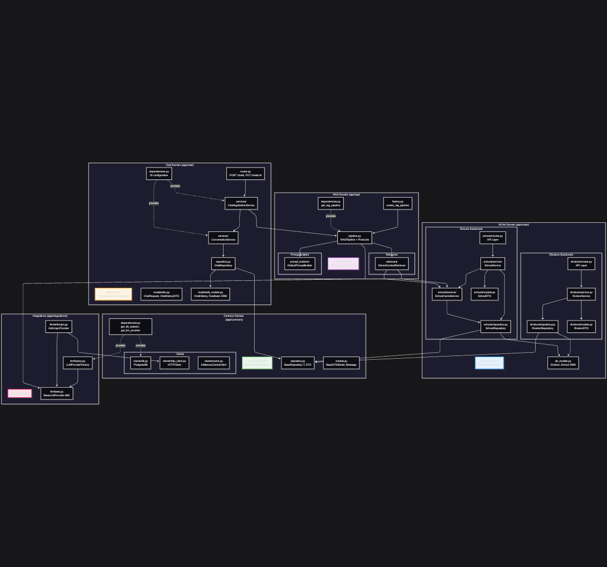

# 6: Domain-Driven Architecture

## Overview: Four-Domain Backend Structure



---

## Domain Responsibilities

### 1. **NCAA Domain** (`app/ncaa/`)

**Purpose**: Manage NCAA divisions and schools data

**Bounded Context**: College sports organizational hierarchy

**Subdomains**:
- **Divisions**: CRUD operations for NCAA divisions (D1, D2, D3, etc.)
- **Schools**: School management with division relationships + context caching

**Key Components**:
- `DivisionService`: Business logic for division queries
- `SchoolService`: Business logic for school queries with filtering
- `SchoolCacheService`: Builds and maintains in-memory cache of school contexts
- `DivisionRepository`, `SchoolRepository`: Data access with BaseRepository inheritance

**API Routes**:
- `GET /api/v1/divisions` - List all divisions
- `GET /api/v1/divisions/{division_id}` - Get division by ID
- `GET /api/v1/schools` - List schools (supports `division_id`, `name_contains` filters)
- `GET /api/v1/schools/{school_id}` - Get school by ID

**Database**:
```
Division (id, division_type)
  └─1:N─> School (id, name, division_id, context, created_date)
```

**Design Pattern**: Vertical Slice Architecture within domain

---

### 2. **Chat Domain** (`app/chat/`)

**Purpose**: Manage chat conversations for users

**Bounded Context**: User conversation lifecycle

**Key Components**:

#### **ChatApplicationService**
- **Responsibility**: Orchestrates chat feature end-to-end
- **Collaborates with**:
  - `RAGPipeline` (from RAG domain) for response generation
  - `ConversationService` for persistence
- **Pattern**: Application Service (coordinates across domains)

#### **ConversationService**
- **Responsibility**: Manages conversation persistence
- **Collaborates with**: `ChatRepository`
- **Methods**: `save_conversation()`, `get_conversation()`, `get_user_conversations()`
- **Pattern**: Domain Service (business logic for persistence)

#### **ChatRepository**
- **Responsibility**: Data access for chat history
- **Extends**: `BaseRepository[ChatHistory, ChatHistoryDTO]`
- **Methods**:
  - `get_user_chats()` - Filter by user_id
  - `save_or_update_chat()` - Upsert operation
  - `update_chat_messages()` - Partial update
  - `get_recent_user_chats()` - Date range queries
  - `delete_user_chats()` - Cascade delete

**API Routes**:
- `POST /api/v1/chats` - Generate response (does NOT save)
- `PUT /api/v1/chats/{chat_id}` - Save/update conversation
- `GET /api/v1/chats/{chat_id}` - Retrieve conversation
- `GET /api/v1/chats/user/{user_id}` - List user's conversations

**Database**:
```
ChatHistory (id, user_id, messages (JSON), created_date, updated_date)
Feedback (id, user_id, feedback, category, created_date)
```

**Design Pattern**: Layered Architecture (Routes → Application Service → Domain Service → Repository)

---

### 3. **RAG Domain** (`app/rag/`)

**Purpose**: Generic Retrieval-Augmented Generation pipeline

**Bounded Context**: Context-aware LLM response generation (domain-agnostic)

**Key Components**:

#### **RAGPipeline**
- **Responsibility**: Orchestrates RAG flow
- **Algorithm** (Template Method):
  1. Retrieve context (via `Retriever` protocol)
  2. Augment messages (via `PromptBuilder`)
  3. Ensure system prompt
  4. Generate response (via `BaseLLMProvider`)
- **Generic**: Works with ANY retriever, prompt builder, or LLM provider

#### **Protocols** (Interfaces)
```python
class Retriever(Protocol):
    async def retrieve(query: str) -> Optional[str]

class PromptBuilder(Protocol):
    def format_user_message(query, context) -> str
    def get_system_prompt() -> str
```

#### **Concrete Implementations**

**SchoolContextRetriever** (`retrievers/school_retriever.py`)
- Implements `Retriever` protocol
- Retrieves school context from `SchoolCacheService`
- O(1) cache lookup by school name

**DefaultPromptBuilder** (`prompt_builders/default.py`)
- Implements `PromptBuilder` protocol
- Wraps context in `<data>` XML tags
- Provides default system prompt

#### **RAG Dependencies** (`dependencies.py`)
- **RAG domain owns its instantiation**
- Assembles: retriever + prompt builder + LLM provider → RAGPipeline
- Pattern: Dependency Injection + Factory

**Design Pattern**:
- Template Method (fixed algorithm, pluggable steps)
- Protocol Pattern (structural typing, no inheritance)
- Strategy Pattern (interchangeable components)

---

### 4. **Common Domain** (`app/common/`)

**Purpose**: Shared infrastructure and cross-cutting concerns

**Bounded Context**: Generic utilities and base abstractions

**Key Components**:

#### **BaseRepository**
```python
class BaseRepository[TModel, TDTO]:
    """Generic CRUD operations with automatic DTO ↔ ORM conversion"""
    async def get_by_id(session, id_value, **filters) -> Optional[TDTO]
    async def get_all(session, limit, offset, **filters) -> List[TDTO]
    async def create(session, dto: TDTO) -> TDTO
    async def update(session, dto: TDTO) -> TDTO
    async def delete(session, id_value) -> bool
    async def exists(session, id_value, **filters) -> bool
```

**Pattern**: Repository Pattern + Template Method

#### **BaseDTOModel**
- Pydantic base class with `from_attributes=True`
- Enables automatic ORM → DTO conversion

#### **Message**
- Universal message format: `{role: str, content: str}`
- Used across: Chat, RAG, LLM integrations
- Pattern: Value Object

#### **Clients**

**PostgresDB** (`clients/db.py`)
- Async SQLAlchemy connection pool
- Context manager: `async with db.session() as session:`

**HTTPClient** (`clients/http_client.py`)
- Async httpx wrapper
- Centralized error handling
- Used by: LLM providers

**CacheClient** (`clients/cache.py`)
- Abstract interface + InMemoryCacheClient implementation
- Used by: SchoolCacheService

**Design Pattern**:
- Singleton (application-scoped resources)
- Factory (client creation)
- Repository (generic data access)

---

### 5. **Integrations** (`app/integrations/`)

**Purpose**: External system integrations

#### **LLM Integration** (`llm/`)

**BaseLLMProvider** (ABC)
```python
async def generate(messages: List[Message], **kwargs) -> Message
```

**AnthropicProvider**
- Concrete implementation for Anthropic Claude API
- Adapter Pattern: Translates Message ↔ Anthropic format
- Provider-specific logic isolated

**LLMProviderFactory**
```python
provider_map = {
    "anthropic": AnthropicProvider,
    "openai": OpenAIProvider,  # Future
}
```
- Factory Pattern: Creates provider based on config
- Extensible: Add provider = 1 new file + 1 line in factory

**Design Pattern**:
- Strategy Pattern (interchangeable providers)
- Adapter Pattern (format translation)
- Factory Pattern (creation logic)

---

## Domain Interaction Patterns

### Cross-Domain Dependencies

```
Chat Domain
  --> consumes RAG Pipeline (RAG Domain)
        --> uses SchoolContextRetriever
              --> accesses SchoolCacheService (NCAA Domain)

Chat Domain
  --> inherits from BaseRepository (Common Domain)

RAG Domain
  --> uses BaseLLMProvider (Integrations)

All Domains
  --> use PostgresDB, HTTPClient (Common Domain)
```

### Dependency Flow Rules

**Allowed**:
- Domain -> Common (shared infrastructure)
- Domain -> Integrations (external systems)
- Domain -> Other Domain (via explicit interface/protocol)

**Forbidden**:
- Common → Domain (no upward dependencies)
- Integrations → Domain (no business logic in integrations)
- Circular dependencies between domains

---

## Key Architectural Decisions

### 1. **NCAA as Unified Domain**
**Decision**: Merge schools and divisions into single `ncaa/` domain

**Rationale**:
- Schools and divisions are tightly coupled (FK relationship)
- Always deployed together
- Shared business context (NCAA organizational structure)

**Alternative considered**: Separate `schools/` and `divisions/` top-level domains
**Rejected because**: Would create artificial boundary, complicate queries

---

### 2. **Chat Owns Conversation Persistence**
**Decision**: Move `ConversationService` and `ChatRepository` from `common/` to `chat/`

**Rationale**:
- Conversation persistence is chat domain concern, not generic infrastructure
- Chat domain owns its data model (ChatHistory)
- Enables chat domain to evolve independently

**Alternative considered**: Keep in `common/conversation/` as generic
**Rejected because**: Not truly generic - specific to chat use case

---

### 3. **RAG Domain Owns RAG Instantiation**
**Decision**: `rag/dependencies.py` assembles RAG pipeline, chat just consumes it

**Rationale**:
- RAG domain encapsulates RAG implementation details
- Chat domain doesn't need to know about retriever/prompt builder composition
- Clear separation: RAG = how to generate, Chat = when to generate

**Alternative considered**: Chat domain assembles RAG components
**Rejected because**: Leaks RAG implementation details into chat domain

---

### 4. **SchoolContextRetriever in RAG Domain**
**Decision**: Retriever lives in `rag/retrievers/`, not `ncaa/schools/`

**Rationale**:
- Retriever is RAG infrastructure, not NCAA business logic
- NCAA domain exposes `SchoolCacheService`, retriever consumes it
- Follows dependency direction: RAG → NCAA (allowed), not NCAA → RAG

**Alternative considered**: Put retriever in `ncaa/schools/retrievers/`
**Rejected because**: Would make NCAA depend on RAG concepts

---

### 5. **Protocols Over Abstract Base Classes**
**Decision**: Use Python `Protocol` for `Retriever` and `PromptBuilder`

**Rationale**:
- Structural typing (duck typing with type safety)
- No inheritance required - cleaner implementation
- Easier to add new implementations (no base class coupling)

**Alternative considered**: `BaseRetriever(ABC)` with abstract methods
**Rejected because**: Unnecessary inheritance hierarchy

---

## File Structure

```
backend/
├── app/
│   ├── main.py                    # FastAPI app setup
│   ├── startup.py                 # Application container + lifespan
│   ├── settings.py                # Configuration
│   ├── utils.py                   # Utilities (logging, etc.)
│   │
│   ├── ncaa/                      # NCAA DOMAIN
│   │   ├── __init__.py
│   │   ├── db_models.py           # Division, School ORM
│   │   ├── divisions/
│   │   │   ├── dependencies.py
│   │   │   ├── models.py          # DivisionDTO
│   │   │   ├── repository.py      # DivisionRepository
│   │   │   ├── routes.py          # /api/v1/divisions
│   │   │   └── service.py         # DivisionService
│   │   └── schools/
│   │       ├── dependencies.py
│   │       ├── models.py          # SchoolDTO
│   │       ├── repository.py      # SchoolRepository
│   │       ├── routes.py          # /api/v1/schools
│   │       └── service/
│   │           ├── cache_service.py    # SchoolCacheService
│   │           └── school_service.py   # SchoolService
│   │
│   ├── chat/                      # CHAT DOMAIN
│   │   ├── dependencies.py        # DI configuration
│   │   ├── repository.py          # ChatRepository
│   │   ├── routes.py              # /api/v1/chats
│   │   ├── models/
│   │   │   ├── db_models.py       # ChatHistory, Feedback ORM
│   │   │   └── dto.py             # ChatRequest, ChatHistoryDTO
│   │   └── services/
│   │       ├── chat_application.py     # ChatApplicationService
│   │       └── conversation_store.py   # ConversationService
│   │
│   ├── rag/                       # RAG DOMAIN
│   │   ├── dependencies.py        # get_rag_pipeline
│   │   ├── factory.py             # create_rag_pipeline
│   │   ├── pipeline.py            # RAGPipeline + Protocols
│   │   ├── prompt_builders/
│   │   │   └── default.py         # DefaultPromptBuilder
│   │   └── retrievers/
│   │       └── school_retriever.py     # SchoolContextRetriever
│   │
│   ├── common/                    # COMMON DOMAIN
│   │   ├── dependencies.py        # get_db_session, get_llm_provider
│   │   ├── models.py              # BaseDTOModel, Message
│   │   ├── repository.py          # BaseRepository[T, DTO]
│   │   └── clients/
│   │       ├── cache.py           # CacheClient, InMemoryCacheClient
│   │       ├── db.py              # PostgresDB
│   │       └── http_client.py    # HTTPClient
│   │
│   └── integrations/              # INTEGRATIONS
│       └── llm/
│           ├── base.py            # BaseLLMProvider ABC
│           ├── anthropic.py       # AnthropicProvider
│           ├── factory.py         # LLMProviderFactory
│           └── models.py          # LLMConfig
```

---

## Benefits of This Architecture

### 1. **Clear Domain Boundaries**
- Each domain has cohesive responsibility
- Easy to understand what lives where
- New developers can navigate by domain concept

### 2. **Independent Evolution**
- NCAA domain can change school logic without affecting chat
- Chat can change conversation persistence without affecting RAG
- RAG can add new retrievers without touching chat

### 3. **Testability**
- Each domain tested independently
- Mock cross-domain dependencies via interfaces
- Clear integration points

### 4. **Reusability**
- RAG pipeline reusable for ANY domain (schools, products, legal, etc.)
- BaseRepository reusable across all domains
- Common clients reusable

### 5. **Extensibility**
- Add new domain: Create new folder, implement interfaces
- Add new retriever: Implement `Retriever` protocol
- Add new LLM provider: Implement `BaseLLMProvider`, update factory

### 6. **Maintainability**
- Bug in chat persistence: Look in `chat/repository.py`
- Bug in school caching: Look in `ncaa/schools/service/cache_service.py`
- Bug in RAG pipeline: Look in `rag/pipeline.py`
- Single responsibility = single place to fix

---

## Anti-Patterns Avoided

### **God Domain**
**Problem**: Everything in one giant `app/services/` folder

**Why avoided**: Clear domain separation prevents monolithic growth

### **Anemic Domain Model**
**Problem**: Services with all logic, models just data

**Why avoided**: Services encapsulate business logic, models are DTOs (appropriate for this architecture)

### **Circular Dependencies**
**Problem**: Domain A → Domain B → Domain A

**Why avoided**: Strict dependency flow rules enforced

### **Leaky Abstractions**
**Problem**: Implementation details leak through interfaces

**Why avoided**:
- Chat doesn't know RAG uses retriever/builder
- RAG doesn't know retriever uses cache
- NCAA doesn't know it's used by RAG

---

## Future Extensions

### Potential New Domains
- **Auth Domain**: User authentication and authorization
- **Analytics Domain**: Usage tracking and metrics
- **Search Domain**: Cross-domain search functionality
- **Notifications Domain**: Real-time user notifications

### Potential Subdomain Splits
If NCAA grows:
- `ncaa/schools/` → separate top-level `schools/` domain
- `ncaa/divisions/` → separate top-level `divisions/` domain

If Chat grows:
- `chat/conversations/` → separate conversation management subdomain
- `chat/feedback/` → separate feedback subdomain

**Guideline**: Split when subdomain can live independently AND has distinct bounded context

---

## Conclusion

This domain-driven architecture provides:
- **Clear boundaries** between business concerns
- **Explicit dependencies** via interfaces/protocols
- **Extensibility** through composition and DI
- **Testability** through isolation and mocking
- **Maintainability** through single responsibility

It's a foundation that scales from MVP to production without major rewrites.
